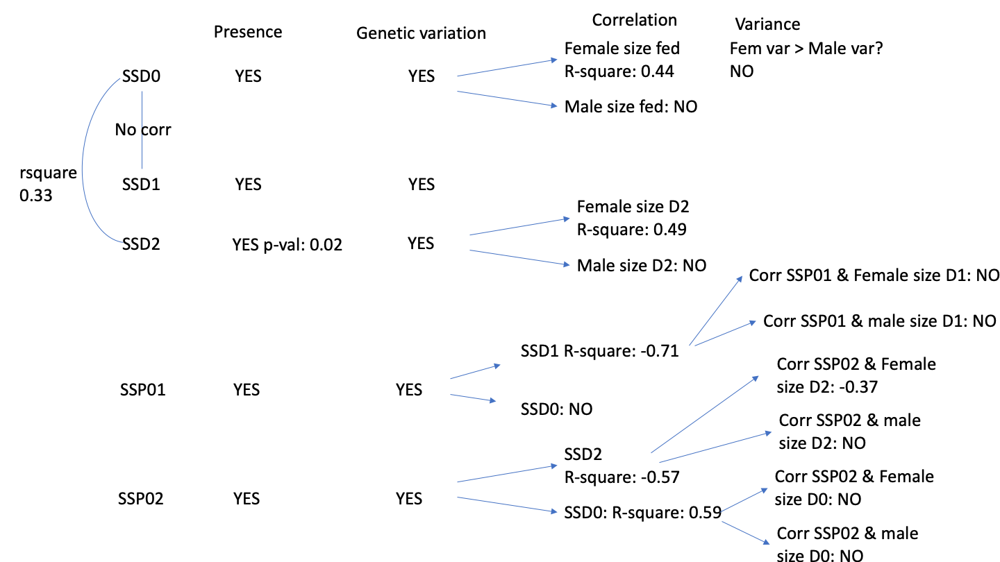

```{r setup, include=FALSE}
knitr::opts_chunk$set(echo = TRUE)
suppressPackageStartupMessages({
 require(lme4)
require(lmerTest)
require(lattice) # for some of the simple plots
require(MCMCglmm) # To get posterior distributions
require(smatr)
require(dplyr)
require(plyr)
require(rrcov)
require(tibble)
require(ggplot2)
require(ggalt)
require(varhandle)
require(magrittr)
require("ggthemes")
require(pbkrtest)  # parametric bootstrap
require(car)
require(tidyverse)
require(hrbrthemes)
require(viridis)
require(tidyr)
require(PerformanceAnalytics)
require(psych)
require(Deducer)
  
 })
R.version
```

#Questions

To better understand how SSD and SSP impact each other, we will test the following hypotheses:

**Bigger scope: I want to test if the variation in SSD is due variation in female size generated both by the environment, and genetic variation.**

To keep in mind: if SSD is associated with SSP, that means a part of the genetic variation that affects SSD is due to the genetic variation in SSP.

We know that female plasticity is higher than male's and we want to check if the variation in plasticity is due to female variation in plasticity.

That would imply that evolutionarily, female size would tend to be the one changing and generating SSD.

- Section 1: SSD in fed flies
  - Question 1.1: Is there Sexual Size Dimorphism in the DGRP lines.
  - Question 1.2: Do we see a genetic variation of SSD in the DGRP lines.
  - Question 1.3: Is the SSD genetic variation due to a genetic variation in male or in female size?

- Section 2: SSD in other conditions
  - Question 2.1: Do we have the same SSD when we change environment?
  - Question 2.2: Does SSD increase or decrease when the flies are starved? Our hypothesis is that overall SSD should decrease
  - Question 2.3: Does the SSD in starved conditions vary the same way as in fed flies?

If there SSD differs between environmental conditions, that means that the plasticity in female and male is different.

-Section 3: SSP
  - Question 3.1: Is there SSP when we look at fed vs starved flies?
  - Question 3.2: Does this SSP vary in the DGRP flies?
  - Question 3.3: Is the variation in SSP due to a variation in SSD in fed or starved flies?
If SSP covaries with SSD0, that means that we have variation in fed flies. If SSP covaries with starved flies, we have variation in the reduction of flies size.
  - Question 3.4: If it is due to SSD in either fed or starved flies, is it because the females vary more or the males vary more in size?
  - Question 3.5: Isthe variation causing SSP (Question 3.4) the same as the variation caused by SSD in Question 1.3?


#Data preparation
```{r,message=FALSE, warning=FALSE}
#dataset was manually relabeled and control lines removed
df <- read.csv("~/Dropbox/_Github_reps/DGRP_SSDSSP/Data/DGRPfinal_clean_first_ctrl_only.csv")

#column names
names(df)
```


```{r}
#add character in front of line, day and block
df$line <- sprintf('L%i', df$line)
df$day<-sprintf('D%i', df$day)
df$block<-sprintf('B%i', df$block)
#summary of data
summary(df)
```


## Filtering out lines with few data
```{r}
#first, create a column to indicate group by line_sex_day. This will be easier to filter out or subset by group later
df$group<- paste(df$line, df$sex, df$day, sep = "_")
head(df)
```
#KEEP THIS HERE BUT RUN BEFORE ANALYSES
```{r}
#filtering out groups (line x sex x day) that have less than 10 flies
#NB: check if I run that filter after na omit before each analysis might not be better?
df_sub<-df%>%
group_by(group) %>%
filter(n() >=10)
```


##Is there variation among blocks  ==> do it later
Flies of lineages were collected in different blocks, periods of time. Control lineages were selected and collected repeatedly for each block so that if there is variation, we can account for that factor.

Look at the control lineages to see whether there is variation among blocks

```{r,message=FALSE, warning=FALSE}
#removing all groups with less than 10 flies
df_sub<-df%>%
group_by(group) %>%
filter(n() >=10)  

df_sub<-na.omit(df_sub,cols=pupa) #195 lines, and 17147 rows

blocktest<-lm(data=df_sub, pupa~block)
summary(blocktest)

#move residuals to dataframe
df_sub$pupa_noblock <- blocktest$resid
head(df_sub)

#df_sub$pupanoblock is the column I will use when I want to calculate summary and indexes for correlation analyses
```

There is a difference between collecting blocks so we have to account for block as a random factor, or adjust the values so there is no variation between blocks.


# SSD in fed flies
  - Question 1.1: Is there Sexual Size Dimorphism in the DGRP lines. A1.1: YES
  - Question 1.2: Do we see a genetic variation of SSD in the DGRP lines. A1.2: YES
  - Question 1.3: Is the SSD genetic variation due to a genetic variation in male or in female size?


## Question 1.1: Is there Sexual Size Dimorphism in the DGRP flies that are normally fed?
To test if we have sexual size dimorphism, we want to test the effect of size with line and block as random factor. If there is a variation due to sex, that means SSD is present.

```{r,message=FALSE, warning=FALSE}
df<-df_sub  #do not forget to reload original csv data if I want to filter out things differently

#subsetting day 0, fed flies
df0<-subset(df, day=="D0") 

#na.omit only if pupa has NA
df0<-na.omit(df0, cols="pupa") #8065 rows
```

```{r}
# Testing effect of sex in pupa size, with random effect for line and block.
SSD<-lmer(pupa~sex+(1|line) +(1|block), REML=TRUE, data=df0)
summary(SSD)
anova(SSD)
```


```{r}
# plotting male and female size mean
df0 %>%
  ggplot( aes(x=sex, y=pupa, fill=sex)) +
    geom_boxplot() +
    scale_fill_viridis(discrete = TRUE, alpha=0.6) +
    geom_jitter(color="black", size=0.4, alpha=0.2) +
    theme_ipsum() +
    theme(
      legend.position="none",
      plot.title = element_text(size=11)
    ) +
    ggtitle("Sexual Size Dimorphism in DGRP flies") +
    xlab("")
```

Answer 1.1: Yes, there is sexual size dimorphism in the DGRP flies, and females are larger than males on average.

## Question 1.2: Do we see a genetic variation of SSD in the DGRP lines.


### Comparing two models using ANOVA
```{r,message=FALSE, warning=FALSE}
#comparing two models
model2<-lmer(pupa~sex+(1|line)+(1|block), data=df0)  #model to test for SSD presence as we did above
model1<-lmer(pupa~sex+(sex|line)+(1|block), data=df0) 
anova(model1)
anova(model1,model2)
```
Model 1 is better, as AIC and BIC is smaller and log likelihood is higher. The difference of fit between these two models is significant.

### Do a LRT
How many parameters for each models
```{r,message=FALSE, warning=FALSE}
(AIC(model1) - REMLcrit(model1))/2 # # of parameters the model "thinks" are being estimated
(AIC(model2) - REMLcrit(model2))/2 # # of parameters the model "thinks" are being estimated

```


So lme4/lmer is treating model 1 as having two more parameters than model2.
```{r,message=FALSE, warning=FALSE}
LR.model <-  -as.numeric(REMLcrit(model1) - REMLcrit(model2))
LR.model
nlevels(df$line)
pchisq(q = LR.model, df=2, lower=F)
pchisq(q = LR.model, df=nlevels(df$line), lower=F)
```

### Parametric boostrap
Finally, we can conduct a parametric bootstrap to compare the two models.

```{r echo=FALSE, message = FALSE, warning=FALSE}
#too long, will run later
#pbtest<-PBmodcomp(model1, model2, nsim=1000, details = 1)
#summary(pbtest)
```

### Finally using Bayesian Analysis

```{r,message=FALSE, warning=FALSE}
prior.2 <-list(R=list(V=0.01, nu=0.002), 
               G=list(G1=list(V=0.01*diag(1), nu=0.002),
                      G2=list(V=0.01*diag(2), nu=0.002)))

model1M.MCMC <- MCMCglmm(pupa ~ 1 + sex, 
  random=~block + us(1 + sex):line,
  prior = prior.2, burnin = 5000, nitt = 20000, thin = 10,
  verbose = F, pr = T,
  data=df0)
summary(model1M.MCMC)
```


### Post model 1 fitting check

#### Residual distribution
```{r,message=FALSE, warning=FALSE}
res_model1=residuals(model1)
```

#### Model 1 residual distribution

```{r,message=FALSE, warning=FALSE}
plot(model1)
```


#### QQ plot
```{r,message=FALSE, warning=FALSE}
require(ggpubr)
ggqqplot(res_model1)
```


#### Random effect plot
```{r,message=FALSE, warning=FALSE}
qqmath(ranef(model1))
```
We have two plots, one for line and one for block

## Question 1.3: Is the SSD genetic variation due to a genetic variation in male or in female size?
To test this, I need to look at the correlation between SSD and male size and SSD and female size, the correlation that is higher means that that sex contributes the most to the SSD variation. 

I need to calculate summary for pupa female size, pupa male size and SSD.

```{r}
#calculate means for each group using pupa_noblock
head(df0)
df0_mean<-aggregate(df0[, 10], list(df0$group), mean)
head(df0_mean)

#re-add line, day and sex columns
df0_mean<-df0_mean %>%
  separate(Group.1, c("line", "sex","day"), "_")
head(df0_mean)
df0_mean$pupa<-df0_mean$pupa_noblock
df0_mean
```


Size Mean by line plot boxplot for fed flies

```{r}
# this plot is based on the variation excluding block effect
head(df0_mean)
df0_mean %>%
  ggplot(aes(sex,pupa_noblock, fill=sex)) +
  geom_boxplot() +
  geom_point(size=0.5)+ 
  geom_line(aes(group=line, alpha=0.1, linewidth=0.5)) +
  theme(legend.position = "none")

```


```{r}
#calculate SSD0
#separating males and females to put the values in columns
df0_mean_F<-subset(df0_mean, sex=="F")
df0_mean_M<-subset(df0_mean, sex=="M")

df0_mean_2<-merge(x=df0_mean_F, y=df0_mean_M, by.x="line", by.y="line")
head(df0_mean_2)

#remove extra columns
df0_mean_2<-df0_mean_2[,c(1,4,8)] #line, pupa_noblockF and pupa_noblockM
colnames(df0_mean_2) <- c("line", "pupaF", "pupaM") #rename col

df0_mean<-df0_mean_2 #move back to df0_mean
df0_mean$SSD0<- df0_mean$pupaF - df0_mean$pupaM  #since we established that females are larger than males in general, SSD is female-male sizes
head(df0_mean) #182 lines
```

Correlation test
```{r}
corr.test(df0_mean[2:4],
          use    = "pairwise",
          method = "pearson",
          adjust = "none")
```


```{r}
chart.Correlation(df0_mean[2:4],
                   method="pearson",
                   histogram=TRUE,
                   pch=16)
```
It seems that SSD in fed flies co-varies with the most with female size. The R2 is not very high though, so it is not all that explains SSD0 variation.


Does female size vary more genetically than male size?

One tail variance F test


```{r}
#Before performing the F test, I need to check that both samples are normally distributed.
require(ggpubr)
ggqqplot(df0_mean$pupaF)
ggqqplot(df0_mean$pupaM)


shapiro.test(df0_mean$pupaM) #normal distribution
shapiro.test(df0_mean$pupaF) #normal distribution


#one tail F test

var.test(df0_mean$pupaF, df0_mean$pupaM, alternative = "greater")
```

The variance in female size is actually not larger than the variance in male size, despite the higher correlation between female size and SSD0, than male size and SS0. So does it mean that SSD0 varies partly because of a co-variation with female size but not from the fact that female size varies more genetically? So where does that SSD variation come from?


# Section 2: SSD in other conditions
We found that in fed flies, females are on average larger than males, so there is a female biased SSD. That SSD also vary genetically. We finally found out that SSD variation is in part driven by the genetic variation of female size, although the variance of female size is the same as male size.

Let's look at different starving conditions

  - Question 2.1: Do we have the same SSD when we change environment? NO
  - Question 2.2: Does SSD increase or decrease when the flies are starved? Our hypothesis is that overall SSD should decrease
  - Question 2.3: Does the SSD in starved conditions vary the same way as in fed flies?
  
## Question 2.1: Do we have the same SSD when we change environment?
### 1 day starvation data
```{r}
#subset day 1 and day 2 starvation

#fisrt subset Day1 data from df_sub
df1<-subset(df_sub, day=="D1") #df_sub N<10 per group filtered out already

#na.omit only if pupa has NA
df1<-na.omit(df1, cols="pupa") #6409 rows
length(unique(df1$line)) #179 lines left
```

```{r}
# Testing effect of sex in pupa size, with random effect for line and block.
SSD1<-lmer(pupa~sex+(1|line) +(1|block), REML=TRUE, data=df1)
summary(SSD1)
anova(SSD1)
```
SSD still exists at 1 day starvation


### 2 day starvation data
```{r}
#subsetting day 2 starvation 
df2<-subset(df_sub, day=="D2") 
#na.omit only if pupa has NA
df2<-na.omit(df2, cols="pupa") #2673 rows
length(unique(df2$line)) #88 lines
```

```{r}
# Testing effect of sex in pupa size, with random effect for line and block.
SSD2<-lmer(pupa~sex+(1|line) +(1|block), REML=TRUE, data=df2)
summary(SSD2)
anova(SSD2)
```

SSD still exists at 2 day starvation


How do I see if the SSDs between treatment are the same? If they are the same, does it mean that would be correlated? But that doesn't mean that if they are correlated, they are from the same female variation. So let's test that

```{r}
#SSD1
# calculate size mean for male and female
head(df1)
df1_mean<-aggregate(df1[, 10], list(df1$group), mean) #calculate mean of pupa_noblock to remove the block effect
head(df1_mean)

#re-add line, day and sex columns
df1_mean<-df1_mean %>%
  separate(Group.1, c("line", "sex","day"), "_")
head(df1_mean)
length(unique(df1_mean$line)) #179 lines
```

```{r}
#separating males and females to put the values in columns
df1_mean_F<-subset(df1_mean, sex=="F")
df1_mean_M<-subset(df1_mean, sex=="M")

df1_mean_2<-merge(x=df1_mean_F, y=df1_mean_M, by.x="line", by.y="line")
head(df1_mean_2)

#remove extra columns
df1_mean_2<-df1_mean_2[,c(1,4,7)] #using pupa_noblock
colnames(df1_mean_2) <- c("line", "pupaF1", "pupaM1")

df1_mean<-df1_mean_2
df1_mean$SSD1<- df1_mean$pupaF1 - df1_mean$pupaM1  #since we established that females are larger than males in general
head(df1_mean) 
length(unique(df1_mean$line)) #157 lines left after calculating SSD1
```

```{r}
#SSD 2
# calculate size mean for male and female
#head(df2)
df2_mean<-aggregate(df2[, 10], list(df2$group), mean)
head(df2_mean)
#re-add line, day and sex columns
df2_mean<-df2_mean %>%
  separate(Group.1, c("line", "sex","day"), "_")
head(df2_mean)


#separating males and females to put the values in columns
df2_mean_F<-subset(df2_mean, sex=="F")
df2_mean_M<-subset(df2_mean, sex=="M")

df2_mean_2<-merge(x=df2_mean_F, y=df2_mean_M, by.x="line", by.y="line")
head(df2_mean_2)

#remove extra columns
df2_mean_2<-df2_mean_2[,c(1,4,7)] 
colnames(df2_mean_2) <- c("line", "pupaF2", "pupaM2")

df2_mean<-df2_mean_2
df2_mean$SSD2<- df2_mean$pupaF2 - df2_mean$pupaM2  #since we established that females are larger than males in general
head(df2_mean) 
length(unique(df2_mean$line)) #59 lines left after I calculate SSD2

```


##Question 2.2: Does overall SSD increase or decrease when the flies are starved? Our hypothesis is that overall SSD should decrease

To make the boxplot, I initially merges SSDs dataframe but it discards all lines that do not have SSD2, so this time I will rbind the dataframes

```{r}
#combining SSDs values without discarding rows, which would happen if I merged the dataframes (we would end up with 59 lines for all SSD2)
SSD0<-df0_mean[,c(1,4)]
SSD0$day<-"D0"
names(SSD0)[names(SSD0) == "SSD0"] <- "SSD"

SSD1<-df1_mean[,c(1,4)]
SSD1$day<-"D1"
names(SSD1)[names(SSD1) == "SSD1"] <- "SSD"

SSD2<-df2_mean[,c(1,4)]
SSD2$day<-"D2"
names(SSD2)[names(SSD2) == "SSD2"] <- "SSD"

SSD_all<-rbind(SSD0,SSD1,SSD2)
```

SSD boxplot, the overall SSD decreases when flies are starved
```{r}
# plotting male and female size mean
SSD_all %>%
  ggplot( aes(x=day, y=SSD)) +
    geom_boxplot() +
    scale_fill_viridis(discrete = TRUE, alpha=0.6) +
    geom_jitter(color="black", size=0.4, alpha=0.2) +
    theme_ipsum() +
    theme(
      legend.position="none",
      plot.title = element_text(size=11)
    ) +
    ggtitle("Sexual Size Dimorphism in DGRP flies at different starving conditions") +
    xlab("")


```
SSD decreases at Day1 starvation but seems to reincrease at day2, let's check if this is significant

I just want to compare the means of SSD.

```{r}
#ANOVA on SSD per day
head(SSD_all)
SSDtest<-aov(data=SSD_all, SSD ~day)
summary(SSDtest)

plot(SSDtest)


model.tables(SSDtest, type="means", se = TRUE)


#Pairwise comparison
TukeyHSD(SSDtest, which = "day")
```

We see that when starved, SSD decreases significantly but the number of days of starvation (1 or 2) does not change SSD significantly.


## Question 2.3: Does the SSD in starved conditions vary the same way as in fed flies?
First, we want to see if there is genetic variation in SSD1 and SSD2
### SSD1
```{r}
#Comparing two model fit for SSD1 to see if there is genetic variation

model2<-lmer(pupa~sex+(1|line)+(1|block), data=df1)  #model to test for SSD presence as we did above
model1<-lmer(pupa~sex+(sex|line)+(1|block), data=df1) 
anova(model1)
anova(model1,model2)
```


Model 1 is better, as AIC and BIC is smaller and log likelihood is higher. The difference of fit between these two models is significant.

### Do a LRT
How many parameters for each models
```{r,message=FALSE, warning=FALSE}
(AIC(model1) - REMLcrit(model1))/2 # # of parameters the model "thinks" are being estimated
(AIC(model2) - REMLcrit(model2))/2 # # of parameters the model "thinks" are being estimated

```


So lme4/lmer is treating model 1 as having two more parameters than model2.
```{r,message=FALSE, warning=FALSE}
LR.model <-  -as.numeric(REMLcrit(model1) - REMLcrit(model2))
LR.model
nlevels(df1$line)
pchisq(q = LR.model, df=2, lower=F)
pchisq(q = LR.model, df=nlevels(df1$line), lower=F)
```

### Parametric boostrap
Finally, we can conduct a parametric bootstrap to compare the two models.

```{r echo=FALSE, message = FALSE, warning=FALSE}
pbtest<-PBmodcomp(model1, model2, nsim=1000, details = 1)
summary(pbtest)
```

### Finally using Bayesian Analysis

```{r,message=FALSE, warning=FALSE}
prior.2 <-list(R=list(V=0.01, nu=0.002), 
               G=list(G1=list(V=0.01*diag(1), nu=0.002),
                      G2=list(V=0.01*diag(2), nu=0.002)))

model1M.MCMC <- MCMCglmm(pupa ~ 1 + sex, 
  random=~block + us(1 + sex):line,
  prior = prior.2, burnin = 5000, nitt = 20000, thin = 10,
  verbose = F, pr = T,
  data=df1)
summary(model1M.MCMC)
```


### Post model 1 fitting check

#### Residual distribution
```{r,message=FALSE, warning=FALSE}
res_model1=residuals(model1)
```

#### Model 1 residual distribution

```{r,message=FALSE, warning=FALSE}
plot(model1)
```


#### QQ plot
```{r,message=FALSE, warning=FALSE}
require(ggpubr)
ggqqplot(res_model1)
```


#### Random effect plot
```{r,message=FALSE, warning=FALSE}
qqmath(ranef(model1))
```


### SSD2
```{r}
#Comparing two model fit for SSD2 to see if there is genetic variation

model2<-lmer(pupa~sex+(1|line)+(1|block), data=df2)  #model to test for SSD presence as we did above
model1<-lmer(pupa~sex+(sex|line)+(1|block), data=df2) 
anova(model1)
anova(model1,model2)
```


Model 1 is better, as AIC and BIC is smaller and log likelihood is higher. The difference of fit between these two models is significant.

### Do a LRT
How many parameters for each models
```{r,message=FALSE, warning=FALSE}
(AIC(model1) - REMLcrit(model1))/2 # # of parameters the model "thinks" are being estimated
(AIC(model2) - REMLcrit(model2))/2 # # of parameters the model "thinks" are being estimated

```


So lme4/lmer is treating model 1 as having two more parameters than model2.
```{r,message=FALSE, warning=FALSE}
LR.model <-  -as.numeric(REMLcrit(model1) - REMLcrit(model2))
LR.model
nlevels(df2$line)
pchisq(q = LR.model, df=2, lower=F)
pchisq(q = LR.model, df=nlevels(df2$line), lower=F)
```

### Parametric boostrap
Finally, we can conduct a parametric bootstrap to compare the two models.

```{r echo=FALSE, message = FALSE, warning=FALSE}
pbtest<-PBmodcomp(model1, model2, nsim=1000, details = 1)
summary(pbtest)
```

### Finally using Bayesian Analysis

```{r,message=FALSE, warning=FALSE}
prior.2 <-list(R=list(V=0.01, nu=0.002), 
               G=list(G1=list(V=0.01*diag(1), nu=0.002),
                      G2=list(V=0.01*diag(2), nu=0.002)))

model1M.MCMC <- MCMCglmm(pupa ~ 1 + sex, 
  random=~block + us(1 + sex):line,
  prior = prior.2, burnin = 5000, nitt = 20000, thin = 10,
  verbose = F, pr = T,
  data=df2)
summary(model1M.MCMC)
```


### Post model 1 fitting check

#### Residual distribution
```{r,message=FALSE, warning=FALSE}
res_model1=residuals(model1)
```

#### Model 1 residual distribution

```{r,message=FALSE, warning=FALSE}
plot(model1)
```


#### QQ plot
```{r,message=FALSE, warning=FALSE}
require(ggpubr)
ggqqplot(res_model1)
```


#### Random effect plot
```{r,message=FALSE, warning=FALSE}
qqmath(ranef(model1))
```
We have two plots, one for line and one for block


SSD1 and SSD2 vary also significantly.

Does that variation correlate with SSD0?

If SSD0 covaries with SSD1/SSD2, that means we should not see a difference in plasticity. We first can visualize how SSD changes across lineages.

```{r}
library(tidyverse)

ggplot(SSD_all, aes(x=reorder(line,SSD), y=SSD)) +
  geom_col(aes(fill = day)) +
  facet_wrap(~ day) +
  coord_flip()


```
Correlation between SSDs. Hypothesis, if SSD changes with environment, which is what we expect, we will not see a correlation between SSD0 and SSD1 and/or SSD2

```{r}
#correlation SSD0, SSD1, SSD2
SSD_all_col<-spread(SSD_all,day ,SSD)

head(SSD_all_col) #D0 is SSD0, D1 is SSD1 and D2 is SSD2

corr.test(SSD_all_col[2:4],
          use    = "pairwise",
          method = "pearson",
          adjust = "none")

chart.Correlation(SSD_all_col[2:4],
                   method="pearson",
                   histogram=TRUE,
                   pch=16)
```
There is a weak correlation between SSD0 and SSD2, still higher than SSD1 and SSD0 

Since there is just a weak correlation between SSD0 and SSD2, I want to know if SSD1 and SSD2 varies because of female size variation as it was found in SSD0.


Correlation SSD2 and female and male size
```{r}
#SSD2 and female and male size dataset
df2_mean


corr.test(df2_mean[2:4],
          use    = "pairwise",
          method = "pearson",
          adjust = "none")
```


```{r}
#correlation plot
chart.Correlation(df2_mean[2:4],
                   method="pearson",
                   histogram=TRUE,
                   pch=16)
```

SSD2 covaries with female size in 2 days starvation.


Will still check SSD1, even though it does not correlate with SSD0, we can see if SSD1 variation covaries with either female or male variation

```{r}
#SSD2 and female and male size dataset
df1_mean


corr.test(df1_mean[2:4],
          use    = "pairwise",
          method = "pearson",
          adjust = "none")
#correlation plot
chart.Correlation(df1_mean[2:4],
                   method="pearson",
                   histogram=TRUE,
                   pch=16)
```
SSD1 has the highest correlation with female size variation


DOES IT MAKE SENSE TO COMPARE CORRELATIONS (is there a statistical test), I want to know if female Day0 variation controls more SSD0 than Day2 female size variation does for SSD2

```{r}


```


We have shown that SSD in different condition changes, that in starved conditions, we have a decrease in overall SSD, and that the variation of SSD partly covariates with female size for SSD0 and SSD2. But the degree of correlation varies? (how to test that?)

But if SSD changes under different conditions, that means that females and males must have a different response to environmental changes, so we should see a sex specific plasticity or SSP.

#Section 3: SSP01 and SSP02
  - Question 3.1: Is there SSP when we look at fed vs starved flies?
  - Question 3.2: Does this SSP vary in the DGRP flies?
  - Question 3.3: Is the variation in SSP due to a variation in SSD in fed or starved flies?
If SSP covaries with SSD0, that means that we have variation in fed flies. If SSP covaries with starved flies, we have variation in the reduction of flies size.
  - Question 3.4: If it is due to SSD in either fed or starved flies, is it because the females vary more or the males vary more in size?
  - Question 3.5: Does the variation causing SSP (Question 3.4) is the same as the variation caused by SSD in Question 1.3?


##Question 3.1: Is there SSP when we look at fed vs starved flies?

### SSP01: between fed and 1 day starved flies
```{r}
# use subset Day 1 and Day 0
df01<-subset(df_sub, day=="D0"|day=="D1")
df01<-na.omit(df01, cols="pupa") #1447  rows

SSP01_test<-lmer(pupa~sex*day+(1|line)+(1|block), REML=TRUE, data=df01) #random effect, there is variation in sex by line and there is variation in plasticity by line.
summary(SSP01_test)
Anova(SSP01_test)

```

### SSP02: between fed and 1 day starved flies
```{r}
# use subset Day 1 and Day 0
df02<-subset(df, day=="D0"|day=="D2")
df02<-na.omit(df02, cols="pupa") #10738 rows
SSP02_test<-lmer(pupa~sex*day+(1|line)+(1|block), REML=TRUE, data=df02) #random effect, there is variation in sex by line and there is variation in plasticity by line.
summary(SSP02_test)
Anova(SSP02_test)

```


##Question 3.2: Does this SSP vary in the DGRP flies?
### SSP01
```{r,message=FALSE, warning=FALSE}
# we want to compare effect of sex and day of starvation on pupal size. I am using df01, subset off data day 0 and day1

model2<-lmer(pupa~sex*day+(1|line)+(1|block), data=df01)
model1<-lmer(pupa~sex*day+(sex+day|line)+(1|block), data=df01)
anova(model1,model2)
```

Model 1 is better.

### Do a LRT
How many parameters for each models
```{r,message=FALSE, warning=FALSE}
(AIC(model1) - REMLcrit(model1))/2 # # of parameters the model "thinks" are being estimated
(AIC(model2) - REMLcrit(model2))/2 # # of parameters the model "thinks" are being estimated

```


So lme4/lmer is treating model 1 as having five more parameters than model2.
```{r,message=FALSE, warning=FALSE}
LR.model <-  -as.numeric(REMLcrit(model1) - REMLcrit(model2))
LR.model
nlevels(df01$line)
pchisq(q = LR.model, df=5, lower=F)
pchisq(q = LR.model, df=nlevels(df01$line), lower=F)
```

### Parametric boostrap
Finally, we can conduct a parametric bootstrap to compare the two models.

```{r echo=FALSE, message = FALSE, warning=FALSE}
#pbtest<-PBmodcomp(model1, model2, nsim=1000, details = 1)
#summary(pbtest)
```

### Finally using Bayesian Analysis
##NB: did not run before need to change the model
```{r,message=FALSE, warning=FALSE}
#prior.2 <-list(R=list(V=0.01, nu=0.002), 
  #             G=list(G1=list(V=0.01*diag(1), nu=0.002),
   #                   G2=list(V=0.01*diag(2), nu=0.002)))

#model1M.MCMC <- MCMCglmm(pupa ~ 1 + sex, #is this right for SSP?
  #random=~block + us(1 + sex):line,
  #prior = prior.2, burnin = 5000, nitt = 20000, thin = 10,
  #verbose = F, pr = T,
  #data=df01)
#summary(model1M.MCMC)
```


### Post model 1 fitting check

#### Residual distribution
```{r,message=FALSE, warning=FALSE}
res_model1=residuals(model1)
```

#### Model 1 residual distribution

```{r,message=FALSE, warning=FALSE}
plot(model1)
```


#### QQ plot
```{r,message=FALSE, warning=FALSE}
require(ggpubr)
ggqqplot(res_model1)
```


#### Random effect plot
```{r,message=FALSE, warning=FALSE}
qqmath(ranef(model1))
```
We have two plots, one for line and one for block


### SSP02
```{r,message=FALSE, warning=FALSE}
# we want to compare effect of sex and day of starvation on pupal size. I am using df02, subset of data by day 0 and day 2
model2<-lmer(pupa~sex*day+(1|line)+(1|block), data=df02)
model1<-lmer(pupa~sex*day+(sex*day|line)+(1|block), data=df02)
anova(model1,model2)
```

Model 1 is better here.

### Do a LRT
How many parameters for each models
```{r,message=FALSE, warning=FALSE}
(AIC(model1) - REMLcrit(model1))/2 # # of parameters the model "thinks" are being estimated
(AIC(model2) - REMLcrit(model2))/2 # # of parameters the model "thinks" are being estimated

```


So lme4/lmer is treating model 1 as having nine more parameters than model2.
```{r,message=FALSE, warning=FALSE}
LR.model <-  -as.numeric(REMLcrit(model1) - REMLcrit(model2))
LR.model
nlevels(df02$line)
pchisq(q = LR.model, df=9, lower=F)
pchisq(q = LR.model, df=nlevels(df02$line), lower=F)
```

### Parametric boostrap
Finally, we can conduct a parametric bootstrap to compare the two models.

```{r echo=FALSE, message = FALSE, warning=FALSE}
#pbtest<-PBmodcomp(model1, model2, nsim=1000, details = 1)
#summary(pbtest)
```

### Finally using Bayesian Analysis
#did not run because need to update model
```{r,message=FALSE, warning=FALSE}
#prior.2 <-list(R=list(V=0.01, nu=0.002), 
 #              G=list(G1=list(V=0.01*diag(1), nu=0.002),
  #                    G2=list(V=0.01*diag(2), nu=0.002)))

#model1M.MCMC <- MCMCglmm(pupa ~ 1 + sex, 
 # random=~block + us(1 + sex):line,
#  prior = prior.2, burnin = 5000, nitt = 20000, thin = 10,
 # verbose = F, pr = T,
#  data=df02)
#summary(model1M.MCMC)
```


### Post model 1 fitting check

#### Residual distribution
```{r,message=FALSE, warning=FALSE}
res_model1=residuals(model1)
```

#### Model 1 residual distribution

```{r,message=FALSE, warning=FALSE}
plot(model1)
```


#### QQ plot
```{r,message=FALSE, warning=FALSE}
require(ggpubr)
ggqqplot(res_model1)
```


#### Random effect plot
```{r,message=FALSE, warning=FALSE}
qqmath(ranef(model1))
```
We have two plots, one for line and one for block


Answer 3.2: There is genetic variation in SSP if we compare fed flies and starved flies. BUT need to check with Alex if my model is correct.


##Question 3.3: Is the variation in SSP due to a variation in SSD in fed or starved flies?
Look at the correlation between SSP01, SSD0 and SSD1
To calculate SSP, I first calculate the plasticity of female and male and subtract the plasticity female-male
```{r}
#calculate plasticity female
head(df1)
df1F<-subset(df1, sex=="F")
head(df1F)
df1F_mean<-aggregate(df1F[, 10], list(df1F$line), mean)
colnames(df1F_mean)<-c("line","pupaFmean_1")
head(df1F_mean)
```

```{r}
df0F<-subset(df0, sex=="F")
df0F_mean<-aggregate(df0F[, 10], list(df0F$line), mean)
colnames(df0F_mean)<-c("line","pupaFmean_0")
head(df0F_mean)

```


```{r}
df2F<-subset(df2, sex=="F")
df2F_mean<-aggregate(df2F[, 10], list(df2F$line), mean)
colnames(df2F_mean)<-c("line","pupaFmean_2")
head(df2F_mean)
```

```{r}
pupa_mean_F01<-merge(x=df0F_mean, y=df1F_mean, by.x="line", by.y="line") #cannot merge all three treatment together or we loose data because less data at Day 2
head(pupa_mean_F01) #151

#for SSP02
pupa_mean_F02<-merge(x=df0F_mean, y=df2F_mean, by.x="line", by.y="line")
head(pupa_mean_F02) #66 lines


pupa_mean_F01$PF01<-pupa_mean_F01$pupaFmean_0-pupa_mean_F01$pupaFmean_1 #calculating plast female 01
pupa_mean_F02$PF02<-pupa_mean_F02$pupaFmean_0-pupa_mean_F02$pupaFmean_2 #calculating plast female 02

plastF01<-pupa_mean_F01 
plastF02<-pupa_mean_F02

```

```{r}
#calculate plasticity male
head(df1)
df1M<-subset(df1, sex=="M")
df1M_mean<-aggregate(df1M[, 10], list(df1M$line), mean)
colnames(df1M_mean)<-c("line","pupaMmean_1")
head(df1M_mean)


df0M<-subset(df0, sex=="M")
df0M_mean<-aggregate(df0M[, 10], list(df0M$line), mean)
colnames(df0M_mean)<-c("line","pupaMmean_0")
head(df0M_mean)

df2M<-subset(df2, sex=="M")
df2M_mean<-aggregate(df2M[, 10], list(df2M$line), mean)
colnames(df2M_mean)<-c("line","pupaMmean_2")
head(df2M_mean)


pupa_mean_M01<-merge(x=df0M_mean, y=df1M_mean, by.x="line", by.y="line") #cannot merge all three treatment together or we loose data because less data at Day 2
head(pupa_mean_F01) #151


pupa_mean_M02<-merge(x=df0M_mean, y=df2M_mean, by.x="line", by.y="line")
head(pupa_mean_M02) #66 lines


pupa_mean_M01$PM01<-pupa_mean_M01$pupaMmean_0-pupa_mean_M01$pupaMmean_1 #calculating SSP01
pupa_mean_M02$PM02<-pupa_mean_M02$pupaMmean_0-pupa_mean_M02$pupaMmean_2 #calculating SSP02

plastM01<-pupa_mean_M01 
plastM02<-pupa_mean_M02
```


```{r}
#SSP01

pupa_SSP01<-merge(x=plastF01, y= plastM01, by.x="line", by.y="line") #merging male and female datasets
head(pupa_SSP01)
length(unique(pupa_SSP01$line)) #146 lines left

#SSP02
pupa_SSP02<-merge(x=plastF02, y= plastM02, by.x="line", by.y="line") #merging male and female datasets
head(pupa_SSP02)
length(unique(pupa_SSP02$line)) #55 lines left

#calculate SSP from the plasticity.
pupa_SSP01$SSP01<-pupa_SSP01$PF01-pupa_SSP01$PM01

pupa_SSP02$SSP02<-pupa_SSP02$PF02-pupa_SSP02$PM02


#calculating SSDs again to add them to the dataframe
pupa_SSP01$SSD0<-pupa_SSP01$pupaFmean_0-pupa_SSP01$pupaMmean_0
pupa_SSP01$SSD1<-pupa_SSP01$pupaFmean_1-pupa_SSP01$pupaMmean_1


pupa_SSP02$SSD0<-pupa_SSP02$pupaFmean_0-pupa_SSP02$pupaMmean_0
pupa_SSP02$SSD2<-pupa_SSP02$pupaFmean_2-pupa_SSP02$pupaMmean_2


```

#### Correlation between SSP and SSDs 

##### SSP01, SSD0 and SSD1
Is SSD0 or 1 covarying with SSP01?
```{r}
#use pupa_SSP01 
head(pupa_SSP01)
SSP01<-pupa_SSP01[c(1,8:10)]
chart.Correlation(SSP01[2:4],
                   method="pearson",
                   histogram=TRUE,
                   pch=16)
```
The highest correlation is between SSD1 and SSP01, and it is a negative correlation, which means that the higher SSP is, the more SSD decreases, at lower food condition, one of the two sexes decreases in size more than it increases in size in fed flies.

#### Correlation SSP01, female Day 1 and male Day 1 size

```{r}
head(pupa_SSP02)
SSP02<-pupa_SSP02[,c(1,8:10)]
head(SSP02)
chart.Correlation(SSP02[2:4],
                   method="pearson",
                   histogram=TRUE,
                   pch=16)


```
There is almost no correlation between SSP01 and male or female size in Day 1 starvation. That means that SSP01 covaries negatively with SSD01, when the difference in plasticity is higher, then sexual size dimorphism decreases. We assumed that this covariation was created by the variation in female size in Day1, but it does not seem to be the case. 

##### Do we have the same trend in SSP02, SSD0 and SSD2?

```{r}
SSP02<-pupa_summary[c(1,15,17,19)]
chart.Correlation(SSP02[2:4],
                   method="pearson",
                   histogram=TRUE,
                   pch=16)

```
SSP02, covaries partly with SSD0 positively and SSD2 negatively.
- The higher difference in plasticity between sexes, the higher there is a difference in sexes in fed flies


If SSP covaries with SSD0, that means that we have variation in fed flies. If SSP covaries with starved flies, we have variation in the reduction of flies size.

### Question 3.4: If it is due to SSD in either fed or starved flies, is it because the females vary more or the males vary more in size?


For SSP02, we see that both SSD0 and SSD2 covary but in a reverse way. Let's see first if SSD0 covariation with SSP02 is due to female size variation as seen in SSD0 vs female size.

```{r}
head(pupa_summary)
SSP02size0<-pupa_summary[,c(1,2,8,15)]
head(SSP02size0)
chart.Correlation(SSP02size0[2:4],
                   method="pearson",
                   histogram=TRUE,
                   pch=16)


```
So we don't see a correlation between SSP02 and fed female and male size.

There is still an negative correlation between SSP02 and SSD2, rsquare:-.57, so I will check the correlation with 2 day starved female and male size


```{r}
head(pupa_summary)
SSP02size2<-pupa_summary[,c(1,4,10,15)]
head(SSP02size2)
chart.Correlation(SSP02size2[2:4],
                   method="pearson",
                   histogram=TRUE,
                   pch=16)


```
Here we there is covariation between female size in starved flies and SSP. 
  
By examining plasticity generated in day 1 starved flies, we cannot see that SSP01 is generated by the variation of female size in starved conditions, even if we see a correlation between SSP01 and SSD1.

However, when we look at SSP02, female size variation in 2 day starvation correlates with SSP02.This happens even though SSP02 covariates also with both SSD0 and SSD2. Does it mean that the more the flies are starve, the moree female size


### Question 3.5: Is the variation causing SSP (Question 3.4) the same as the variation caused by SSD in Question 1.3?

We saw that we only see a covariation between SSP and pupal size when we examined day0 and day2 plasticity. In that case, SSP02 is correlated negatively with female size in day2 starvation. 

In Question 1.3, we found that SSD0 (in fed flies) is correlated with fed female size, but that fed female size variation does not correlate with SSPs. 

If there is no direct correlation between SSP and SSD in fed flies, let's check how the variation of plasticity between each sexes covaries with SSP.

### Question 3.6: Do we see a correlation between SSP and plasticity

#### Correlation SSP01, plasticity female, plasticity male
```{r}
head(pupa_summary)
SSP01_plast<-pupa_summary[,c(1,5,11,14)]
head(SSP01_plast)
chart.Correlation(SSP01_plast[2:4],
                   method="pearson",
                   histogram=TRUE,
                   pch=16)

```
SSP01 is correlated with plasticity in female.


```{r}
head(pupa_summary)
SSP02_plast<-pupa_summary[,c(1,6,12,15)]
head(SSP02_plast)
chart.Correlation(SSP02_plast[2:4],
                   method="pearson",
                   histogram=TRUE,
                   pch=16)


```

SSP02 is also correlated with female plasticity.
In both cases, we see that SSPs are correlated with a variation in female plasticity.

Now, I want to see if the variance of female plasticity is significantly different than the variance of male plasticity.

For plasticity 0-1
```{r}
#dataset 

head(SSP01_plast)
#one tail F test

var.test(SSP01_plast$PF01, SSP01_plast$PM01, alternative = "greater")

```


```{r}
#dataset 

head(SSP02_plast)
#one tail F test

var.test(SSP02_plast$PF02, SSP02_plast$PM02, alternative = "greater")


```
In both cases, plasticity if female does not vary more than plasticity of male.


# Summary



#plots
##Compare size male and female fed flies across lines: plotting SSD in decreasing number
```{r}
head(df0_mean)

df0_mean$line <- factor(df0_mean$line, levels = df0_mean$line[order(df0_mean$pupaF)])

ggplot(df0_mean,aes(x=pupaF, xend=pupaM, y=line, group=line))+
geom_dumbbell(size=0.5, color="black",
colour_x = "magenta", colour_xend = "cyan",
dot_guide=F, dot_guide_size=0.5)
```

```{r}
head(df1_mean)

df1_mean$line <- factor(df1_mean$line, levels = df1_mean$line[order(df1_mean$pupaF1)])

ggplot(df1_mean,aes(x=pupaF1, xend=pupaM1, y=line, group=line))+
geom_dumbbell(size=0.5, color="black",
colour_x = "magenta", colour_xend = "cyan",
dot_guide=F, dot_guide_size=0.5)

```

```{r}
head(df2_mean)

df2_mean$line <- factor(df2_mean$line, levels = df2_mean$line[order(df2_mean$pupaF2)])

ggplot(df2_mean,aes(x=pupaF2, xend=pupaM2, y=line, group=line))+
geom_dumbbell(size=0.5, color="black",
colour_x = "magenta", colour_xend = "cyan",
dot_guide=F, dot_guide_size=0.5)

```


