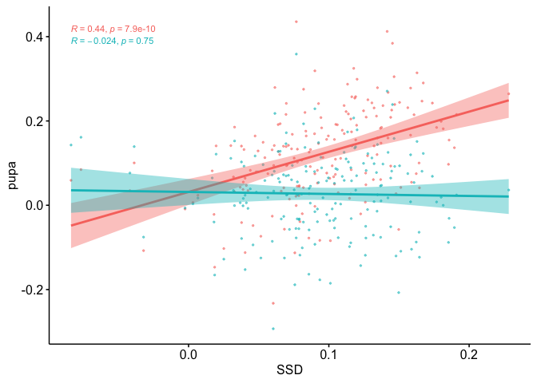
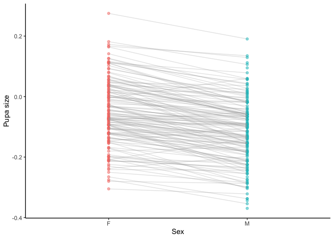
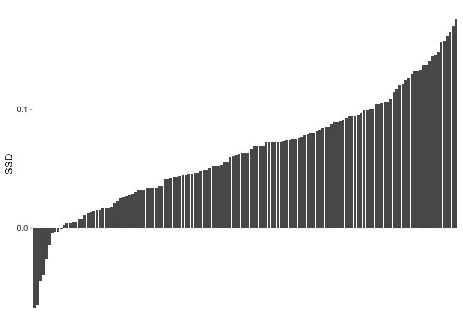

# Sept 29 2020
 - aggregate plots to figures by section

#Pre-processing of data
  - n<10 groups removed
  - remove block effect when calculating SSD and SSP 


# Data preparation
importing file and checking for column names

```r
#dataset was manually relabeled and control lines removed
df <- read.csv("~/Dropbox/_Github_reps/DGRP_SSDSSP/Data/DGRPfinal_clean_first_ctrl_only.csv")

#column names
names(df)
```

```
## [1] "id"    "line"  "block" "day"   "sex"   "wing"  "leg"   "pupa"
```

add a letter in front of factorial columns

```r
#add character in front of line, day and block
df$line <- sprintf('L%i', df$line)
df$day<-sprintf('D%i', df$day)
df$block<-sprintf('B%i', df$block)
#summary of data
summary(df) #21410 rows
```

```
##       id                line              block               day           
##  Length:21410       Length:21410       Length:21410       Length:21410      
##  Class :character   Class :character   Class :character   Class :character  
##  Mode  :character   Mode  :character   Mode  :character   Mode  :character  
##                                                                             
##                                                                             
##                                                                             
##                                                                             
##      sex                 wing            leg             pupa      
##  Length:21410       Min.   :11.29   Min.   :12.95   Min.   :13.82  
##  Class :character   1st Qu.:13.79   1st Qu.:13.52   1st Qu.:14.28  
##  Mode  :character   Median :13.93   Median :13.66   Median :14.42  
##                     Mean   :13.93   Mean   :13.65   Mean   :14.41  
##                     3rd Qu.:14.07   3rd Qu.:13.79   3rd Qu.:14.55  
##                     Max.   :14.55   Max.   :14.38   Max.   :15.14  
##                     NA's   :638     NA's   :828     NA's   :2136
```

## Create group column for filtering

```r
#first, create a column to indicate group by line_sex_day. This will be easier to filter out or subset by group later
df$group<- paste(df$line, df$sex, df$day, sep = "_")
head(df,2)
```

```
##              id line block day sex     wing      leg     pupa    group
## 1 021-A-0-F-085  L21    B6  D0   F 14.23040 13.93253 14.70779 L21_F_D0
## 2 021-A-0-F-086  L21    B6  D0   F 13.99867 13.65442 14.43095 L21_F_D0
```

### KEEP THIS HERE BUT RUN BEFORE ANALYSES

```r
#filtering out groups (line x sex x day) that have less than 10 flies
#NB: check if I run that filter after na omit before each analysis might not be better?
#df_sub<-df%>%
#group_by(group) %>%
#filter(n() >=10)
```


## Is there variation among blocks = OK
Flies of lineages were collected in different blocks, periods of time. Control lineages were selected and collected repeatedly for each block so that if there is variation, we can account for that factor.

Look at the control lineages to see whether there is variation among blocks
Adjusting pupa size, removing block effect

```r
#filtering out all groups with less than 10 flies
df_sub<-df%>%
group_by(group) %>%
filter(n() >=10)  

#how many Na in pupae
sum(is.na(df_sub$pupa)) #1970 Nas
```

```
## [1] 1970
```

```r
#remove NA in wing column
df_sub<-df_sub[!is.na(df_sub$pupa), ]

#subset fed and 1day starved flies
df_sub01<-subset(df_sub, day=="D0"|day=="D1")

#lm with block fixed effect
blocktest01<-lm(pupa~block, data=df_sub01)
summary(blocktest01)
```

```
## 
## Call:
## lm(formula = pupa ~ block, data = df_sub01)
## 
## Residuals:
##      Min       1Q   Median       3Q      Max 
## -0.64395 -0.12171  0.00728  0.12808  0.65787 
## 
## Coefficients:
##              Estimate Std. Error  t value Pr(>|t|)    
## (Intercept) 14.480592   0.004798 3018.031  < 2e-16 ***
## blockB11    -0.019641   0.007123   -2.757  0.00584 ** 
## blockB12     0.014971   0.006733    2.223  0.02620 *  
## blockB13    -0.009908   0.007227   -1.371  0.17038    
## blockB4     -0.031259   0.006391   -4.892 1.01e-06 ***
## blockB5     -0.029399   0.005959   -4.933 8.17e-07 ***
## blockB6     -0.083454   0.006264  -13.322  < 2e-16 ***
## blockB7     -0.092453   0.006147  -15.039  < 2e-16 ***
## blockB8     -0.052912   0.006674   -7.928 2.38e-15 ***
## ---
## Signif. codes:  0 '***' 0.001 '**' 0.01 '*' 0.05 '.' 0.1 ' ' 1
## 
## Residual standard error: 0.1809 on 15385 degrees of freedom
## Multiple R-squared:  0.03598,	Adjusted R-squared:  0.03547 
## F-statistic: 71.77 on 8 and 15385 DF,  p-value: < 2.2e-16
```

```r
Anova(blocktest01)
```

```
## Anova Table (Type II tests)
## 
## Response: pupa
##           Sum Sq    Df F value    Pr(>F)    
## block      18.78     8  71.768 < 2.2e-16 ***
## Residuals 503.29 15385                      
## ---
## Signif. codes:  0 '***' 0.001 '**' 0.01 '*' 0.05 '.' 0.1 ' ' 1
```

```r
#move residuals to dataframe
df_sub01$pupa_noblock <- blocktest01$resid
head(df_sub01,2)
```

```
## # A tibble: 2 x 10
## # Groups:   group [1]
##   id            line  block day   sex    wing   leg  pupa group    pupa_noblock
##   <chr>         <chr> <chr> <chr> <chr> <dbl> <dbl> <dbl> <chr>           <dbl>
## 1 021-A-0-F-085 L21   B6    D0    F      14.2  13.9  14.7 L21_F_D0       0.311 
## 2 021-A-0-F-086 L21   B6    D0    F      14.0  13.7  14.4 L21_F_D0       0.0338
```

```r
write.csv(df_sub01,"/Users/isabelle/Dropbox/_Github_reps/DGRP_SSDSSP/Data/df_sub01.csv")
#df_sub01$pupanoblock is the column I will use when I want to calculate summary and indexes for correlation analyses

#rerun lm on pupa_noblock
blocktest01_2<-lm(pupa_noblock~block, data=df_sub01)
summary(blocktest01_2)
```

```
## 
## Call:
## lm(formula = pupa_noblock ~ block, data = df_sub01)
## 
## Residuals:
##      Min       1Q   Median       3Q      Max 
## -0.64395 -0.12171  0.00728  0.12808  0.65787 
## 
## Coefficients:
##               Estimate Std. Error t value Pr(>|t|)
## (Intercept) -2.199e-16  4.798e-03       0        1
## blockB11     1.190e-17  7.123e-03       0        1
## blockB12    -8.512e-18  6.733e-03       0        1
## blockB13     2.734e-16  7.227e-03       0        1
## blockB4     -3.380e-16  6.391e-03       0        1
## blockB5      1.069e-15  5.959e-03       0        1
## blockB6      2.592e-16  6.264e-03       0        1
## blockB7      1.940e-17  6.147e-03       0        1
## blockB8      5.121e-19  6.674e-03       0        1
## 
## Residual standard error: 0.1809 on 15385 degrees of freedom
## Multiple R-squared:  5.867e-30,	Adjusted R-squared:  -0.00052 
## F-statistic: 1.128e-26 on 8 and 15385 DF,  p-value: 1
```

```r
Anova(blocktest01_2) #block effect is gone!
```

```
## Anova Table (Type II tests)
## 
## Response: pupa_noblock
##           Sum Sq    Df F value Pr(>F)
## block       0.00     8       0      1
## Residuals 503.29 15385
```

There is a difference between collecting blocks so we have to account for block as a random factor when using lmer, or use the adjusted values to calculate SSD and SSP values.


# Section 1: SSD in fed flies
  - Question 1.1: Is there Sexual Size Dimorphism in the DGRP lines. A1.1: YES
  - Question 1.2: Do we see a genetic variation of SSD in the DGRP lines. A1.2: YES
  - Question 1.3: Is the SSD genetic variation due to a genetic variation in male or in female size? FEMALE
  


## Question 1.1: Is there Sexual Size Dimorphism in the DGRP flies that are normally fed?
To test if we have sexual size dimorphism, we want to test the effect of size with line and block as random factor. If there is a variation due to sex, that means SSD is present.


```r
df<-df_sub01  #do not forget to reload original csv data if I want to filter out things differently

#subsetting day 0, fed flies
df0<-subset(df, day=="D0") #8500
head(df0,2) 
```

```
## # A tibble: 2 x 10
## # Groups:   group [1]
##   id            line  block day   sex    wing   leg  pupa group    pupa_noblock
##   <chr>         <chr> <chr> <chr> <chr> <dbl> <dbl> <dbl> <chr>           <dbl>
## 1 021-A-0-F-085 L21   B6    D0    F      14.2  13.9  14.7 L21_F_D0       0.311 
## 2 021-A-0-F-086 L21   B6    D0    F      14.0  13.7  14.4 L21_F_D0       0.0338
```

```r
#na.omit only if pupa has NA if not done before
#df0<-na.omit(df0, cols="pupa") 
```

### Linear Mixed Model on fed flies


```r
# Testing effect of sex in pupa size, with random effect for line and block.
SSDtest<-lmer(pupa~sex+(1|line) +(1|block), REML=TRUE, data=df0)
summary(SSDtest) #Number of obs: 8065, groups:  line, 187; block, 9
```

```
## Linear mixed model fit by REML. t-tests use Satterthwaite's method [
## lmerModLmerTest]
## Formula: pupa ~ sex + (1 | line) + (1 | block)
##    Data: df0
## 
## REML criterion at convergence: -11807
## 
## Scaled residuals: 
##     Min      1Q  Median      3Q     Max 
## -5.4453 -0.6081  0.0870  0.6708  3.1077 
## 
## Random effects:
##  Groups   Name        Variance Std.Dev.
##  line     (Intercept) 0.010007 0.10003 
##  block    (Intercept) 0.002205 0.04696 
##  Residual             0.013471 0.11607 
## Number of obs: 8500, groups:  line, 187; block, 9
## 
## Fixed effects:
##               Estimate Std. Error         df t value Pr(>|t|)    
## (Intercept)  1.456e+01  1.758e-02  1.003e+01   828.3   <2e-16 ***
## sexM        -9.443e-02  2.559e-03  8.326e+03   -36.9   <2e-16 ***
## ---
## Signif. codes:  0 '***' 0.001 '**' 0.01 '*' 0.05 '.' 0.1 ' ' 1
## 
## Correlation of Fixed Effects:
##      (Intr)
## sexM -0.076
```

```r
Anova(SSDtest)
```

```
## Analysis of Deviance Table (Type II Wald chisquare tests)
## 
## Response: pupa
##      Chisq Df Pr(>Chisq)    
## sex 1361.9  1  < 2.2e-16 ***
## ---
## Signif. codes:  0 '***' 0.001 '**' 0.01 '*' 0.05 '.' 0.1 ' ' 1
```

```r
plot(SSDtest)
```

<!-- -->

```r
qqnorm(resid(SSDtest))
qqline(resid(SSDtest))
```

<!-- -->

Outputting model fit results to a Table

```r
class(SSDtest) <- "lmerMod"
stargazer(SSDtest, style="ajps", type="text", title="Sexual Size Dimorphism in fed flies")
```

```
## 
## Sexual Size Dimorphism in fed flies
## -------------------------------
##                       pupa     
## -------------------------------
## sexM                -0.094***  
##                      (0.003)   
## Constant            14.563***  
##                      (0.018)   
## N                     8500     
## Log Likelihood      5903.525   
## AIC                -11797.050  
## BIC                -11761.810  
## -------------------------------
## ***p < .01; **p < .05; *p < .1
```


Answer 1.1: Yes, there is sexual size dimorphism in the DGRP flies, and females are larger than males on average.


## Question 1.2: Do we see a genetic variation of SSD in the DGRP lines?
### Comparing two models using ANOVA

```r
#comparing two models
model2<-lmer(pupa~sex+(1|line)+(1|block), data=df0)  #model to test for SSD presence as we did above
model1<-lmer(pupa~sex+(sex|line)+(1|block), data=df0) 
anova(model1)
```

```
## Type III Analysis of Variance Table with Satterthwaite's method
##     Sum Sq Mean Sq NumDF DenDF F value    Pr(>F)    
## sex 9.8828  9.8828     1 155.3  745.76 < 2.2e-16 ***
## ---
## Signif. codes:  0 '***' 0.001 '**' 0.01 '*' 0.05 '.' 0.1 ' ' 1
```

```r
anova(model1,model2)
```

```
## Data: df0
## Models:
## model2: pupa ~ sex + (1 | line) + (1 | block)
## model1: pupa ~ sex + (sex | line) + (1 | block)
##        npar    AIC    BIC logLik deviance  Chisq Df Pr(>Chisq)    
## model2    5 -11813 -11778 5911.7   -11823                         
## model1    7 -11851 -11801 5932.3   -11865 41.191  2  1.136e-09 ***
## ---
## Signif. codes:  0 '***' 0.001 '**' 0.01 '*' 0.05 '.' 0.1 ' ' 1
```

Stargazer output

```r
class(model1) <- "lmerMod"
class(model2) <- "lmerMod"
stargazer(model1,model2, style="ajps", type="text", title="Sexual Size Dimorphism Genetic Variation")
```

```
## 
## Sexual Size Dimorphism Genetic Variation
## ------------------------------------
##                        pupa         
##                 Model 1    Model 2  
## ------------------------------------
## sexM           -0.095***  -0.094*** 
##                 (0.003)    (0.003)  
## Constant       14.563***  14.563*** 
##                 (0.018)    (0.018)  
## N                 8500       8500   
## Log Likelihood  5924.405   5903.525 
## AIC            -11834.810 -11797.050
## BIC            -11785.480 -11761.810
## ------------------------------------
## ***p < .01; **p < .05; *p < .1
```


Model 1 is better, as AIC and BIC is smaller and log likelihood is higher. The difference of fit between these two models is significant.

#### Do a LRT
How many parameters for each models

```r
(AIC(model1) - REMLcrit(model1))/2 # # of parameters the model "thinks" are being estimated
```

```
## [1] 7
```

```r
(AIC(model2) - REMLcrit(model2))/2 # # of parameters the model "thinks" are being estimated
```

```
## [1] 5
```


So lme4/lmer is treating model 1 as having two more parameters than model2.

```r
LR.model <-  -as.numeric(REMLcrit(model1) - REMLcrit(model2))
LR.model
```

```
## [1] 41.76099
```

```r
nlevels(df$line)
```

```
## [1] 0
```

```r
pchisq(q = LR.model, df=2, lower=F)
```

```
## [1] 8.545078e-10
```

```r
pchisq(q = LR.model, df=nlevels(df$line), lower=F)
```

```
## [1] 0
```

#### Parametric boostrap
Finally, we can conduct a parametric bootstrap to compare the two models.


#### Finally using Bayesian Analysis


```r
#prior.2 <-list(R=list(V=0.01, nu=0.002), 
 #              G=list(G1=list(V=0.01*diag(1), nu=0.002),
  #                    G2=list(V=0.01*diag(2), nu=0.002)))

#model1M.MCMC <- MCMCglmm(pupa ~ 1 + sex, 
 # random=~block + us(1 + sex):line,
  #prior = prior.2, burnin = 5000, nitt = 20000, thin = 10,
  #verbose = F, pr = T,
  #data=df0)
#summary(model1M.MCMC)
```


#### Post model 1 fitting check

##### Residual distribution


##### Model 1 residual distribution


```r
plot(model1)
```

<!-- -->


##### QQ plot

```r
res_model1=residuals(model1)
ggqqplot(res_model1)
```

<!-- -->


##### Random effect plot

```r
qqmath(ranef(model1))
```

```
## $line
```

<!-- -->

```
## 
## $block
```

<!-- -->


### Plot mean size female and male per line + SSD per line
Calculate mean size per line

```r
#calculate means for each group using pupa_noblock
head(df0,2)
```

```
## # A tibble: 2 x 10
## # Groups:   group [1]
##   id            line  block day   sex    wing   leg  pupa group    pupa_noblock
##   <chr>         <chr> <chr> <chr> <chr> <dbl> <dbl> <dbl> <chr>           <dbl>
## 1 021-A-0-F-085 L21   B6    D0    F      14.2  13.9  14.7 L21_F_D0       0.311 
## 2 021-A-0-F-086 L21   B6    D0    F      14.0  13.7  14.4 L21_F_D0       0.0338
```

```r
df0_mean<-aggregate(df0[, 10], list(df0$group), mean)
head(df0_mean,2)
```

```
##     Group.1 pupa_noblock
## 1 L100_F_D0   0.23636559
## 2 L100_M_D0   0.09779092
```

```r
#re-add line, day and sex columns
df0_mean<-df0_mean %>%
  separate(Group.1, c("line", "sex","day"), "_")
head(df0_mean,2)
```

```
##   line sex day pupa_noblock
## 1 L100   F  D0   0.23636559
## 2 L100   M  D0   0.09779092
```

#### Plot mean size per line

```r
plot1<-ggplot(df0_mean, aes(x = sex, y = pupa_noblock, color=sex)) +
  geom_point(aes(fill = sex), alpha = 0.5) +
  geom_line(aes(group = interaction(line)),
            alpha = 0.3, colour = "darkgrey") + theme_classic()+labs(y="Pupa size",x="Sex")+theme(legend.position = "none")

plot1
```

<!-- -->

```r
#add predicted means
```


### Box plot showing average difference in pupal size between male and female => ok

```r
library(effects)
plot(Effect(c("sex"),model1))
```

<!-- -->


```r
df0_fit<-df0
df0_fit$fit <- predict(model1)
head(df0_fit,2)
```

```
## # A tibble: 2 x 11
## # Groups:   group [1]
##   id         line  block day   sex    wing   leg  pupa group  pupa_noblock   fit
##   <chr>      <chr> <chr> <chr> <chr> <dbl> <dbl> <dbl> <chr>         <dbl> <dbl>
## 1 021-A-0-F… L21   B6    D0    F      14.2  13.9  14.7 L21_F…       0.311   14.5
## 2 021-A-0-F… L21   B6    D0    F      14.0  13.7  14.4 L21_F…       0.0338  14.5
```

```r
plot1A<-ggplot(df0_fit,aes(sex, pupa, group=interaction(sex, day))) + 
      facet_grid(~day) +
      geom_point(alpha = 0.3, size=0.2) + 
      theme_bw()+
      geom_boxplot(aes(y=fit, group=interaction(sex,day), col=sex), size=0.8 )
plot1A
```

<!-- -->


Calculate SSD index 

```r
#calculate SSD0
#separating males and females to put the values in columns
df0_mean_F<-subset(df0_mean, sex=="F")
df0_mean_M<-subset(df0_mean, sex=="M")

df0_mean_2<-merge(x=df0_mean_F, y=df0_mean_M, by.x="line", by.y="line")
head(df0_mean_2,2)
```

```
##   line sex.x day.x pupa_noblock.x sex.y day.y pupa_noblock.y
## 1 L100     F    D0     0.23636559     M    D0     0.09779092
## 2 L101     F    D0     0.08156526     M    D0     0.06470751
```

```r
#remove extra columns
df0_mean_2<-df0_mean_2[,c(1,4,7)] #line, pupa_noblockF and pupa_noblockM
colnames(df0_mean_2) <- c("line", "pupaF", "pupaM") #rename col

SSD0<-df0_mean_2 #move back to df0_mean
SSD0$SSD<- SSD0$pupaF - SSD0$pupaM  #since we established that females are larger than males in general, SSD is female-male sizes
head(SSD0,2)#182 lines
```

```
##   line      pupaF      pupaM        SSD
## 1 L100 0.23636559 0.09779092 0.13857467
## 2 L101 0.08156526 0.06470751 0.01685776
```


```r
plot2<-ggplot(SSD0, aes(x=reorder(line,SSD), y=SSD)) +
  geom_col() +
  theme(axis.text.x=element_blank(),
        axis.ticks.x=element_blank(),axis.title.x=element_blank(), plot.background = element_rect(fill = "white"),panel.background = element_rect(fill = "white", colour="white")) 

plot2 +
  labs(x = "DGRP line")
```

<!-- -->


## Question 1.3: Is SSD genetic variation due to the genetic variation in male or in female size?

Correlation test and plot

```r
#reshape data
SSD0_gather<-gather(SSD0,key="sex",value="pupa",pupaF:pupaM)
#plot
plot3 <- ggscatter(SSD0_gather, x = "SSD", y = "pupa",
   color = "sex",
   add = "reg.line", conf.int = TRUE, alpha=0.5, size=0.5) +theme(legend.position="none") +ggpubr::stat_cor(aes(color = sex), size=3) 
plot3 #stat_cor uses the Pearson correlation
```

```
## `geom_smooth()` using formula 'y ~ x'
```

<!-- -->

In fed flies, SSD covaries with female size.


#### Arrange plots together Figure 1

```r
ggarrange(ggarrange(plot1,plot3,ncol=2, labels=c("A","C")),plot2,nrow=2, heights = c(1.5,1),labels=c("A","B"))
```

```
## `geom_smooth()` using formula 'y ~ x'
```

<!-- -->


# Section 2: SSD in starved flies
We found that in fed flies, SSD is female biased and it varies genetically. We finally found out that SSD covaries with female size.

How is SSD in starved conditions?

- Section 2: SSD in starved flies - use D1
  - Question 2.1: Is SSD in starved flies the same as in fed flies? (do a lmer sex*day on D0 and D1)
  - Question 2.2: Does overall SSD increase or decrease when the flies are starved? Our hypothesis is that overall SSD should decrease
  - Question 2.3: Does SSD in starved conditions vary, and does it covary with SSD0?
  
## Question 2.1: Do we have the same SSD when we change environment?
### 1 day starvation data preparation = OK

```r
#fisrt subset Day1 data from df_sub
df1<-subset(df_sub01, day=="D1") 
#na.omit only if pupa has NA
df1<-df1[!is.na(df1$pupa), ] #just in case, but already removed previously
df1<-df1%>%
group_by(group) %>%
filter(n() >=10)  
length(unique(df1$line)) #174 lines left
```

```
## [1] 174
```

### Model fit for SSD

```r
# Testing effect of sex in pupa size, with random effect for line and block.
SSD1test<-lmer(pupa~sex+(1|line) +(1|block), REML=TRUE, data=df1)
summary(SSD1test)
```

```
## Linear mixed model fit by REML. t-tests use Satterthwaite's method [
## lmerModLmerTest]
## Formula: pupa ~ sex + (1 | line) + (1 | block)
##    Data: df1
## 
## REML criterion at convergence: -7497.8
## 
## Scaled residuals: 
##     Min      1Q  Median      3Q     Max 
## -4.6775 -0.6418  0.0128  0.6666  3.3590 
## 
## Random effects:
##  Groups   Name        Variance Std.Dev.
##  line     (Intercept) 0.011182 0.10575 
##  block    (Intercept) 0.001546 0.03932 
##  Residual             0.017728 0.13315 
## Number of obs: 6754, groups:  line, 174; block, 9
## 
## Fixed effects:
##               Estimate Std. Error         df t value Pr(>|t|)    
## (Intercept)  1.439e+01  1.581e-02  8.509e+00  910.70   <2e-16 ***
## sexM        -6.419e-02  3.403e-03  6.658e+03  -18.86   <2e-16 ***
## ---
## Signif. codes:  0 '***' 0.001 '**' 0.01 '*' 0.05 '.' 0.1 ' ' 1
## 
## Correlation of Fixed Effects:
##      (Intr)
## sexM -0.118
```

```r
Anova(SSD1test)
```

```
## Analysis of Deviance Table (Type II Wald chisquare tests)
## 
## Response: pupa
##      Chisq Df Pr(>Chisq)    
## sex 355.75  1  < 2.2e-16 ***
## ---
## Signif. codes:  0 '***' 0.001 '**' 0.01 '*' 0.05 '.' 0.1 ' ' 1
```
SSD still exists at 1 day starvation


### Plots 

```r
#calculate means for each group using pupa_noblock
df1_mean<-aggregate(df1[, 10], list(df1$group), mean)
head(df1_mean,2)
```

```
##     Group.1 pupa_noblock
## 1 L100_F_D1   0.04734688
## 2 L100_M_D1   0.03662500
```

```r
#re-add line, day and sex columns
df1_mean<-df1_mean %>%
  separate(Group.1, c("line", "sex","day"), "_")
head(df1_mean,2)
```

```
##   line sex day pupa_noblock
## 1 L100   F  D1   0.04734688
## 2 L100   M  D1   0.03662500
```

PLOT 4: mean female and male size connected

```r
plot4<-ggplot(df1_mean, aes(x = sex, y = pupa_noblock, color=sex)) +
  geom_point(aes(fill = sex), alpha = 0.5) +
  geom_line(aes(group = interaction(line)),
            alpha = 0.3, colour = "darkgrey") + theme_classic()+labs(y="Pupa size",x="Sex")+theme(legend.position = "none")

plot4
```

<!-- -->

```r
#add predicted means
```


## Question 2.2: Does overall SSD increase or decrease when the flies are starved? Our hypothesis is that overall SSD should decrease

Use df_sub01

```r
model2<-lmer(pupa~sex*day+(sex+day|line)+(1|block), data=df_sub01)
model1<-lmer(pupa~sex*day+(sex*day|line)+(1|block), data=df_sub01)
anova(model1,model2)
```

```
## refitting model(s) with ML (instead of REML)
```

```
## Data: df_sub01
## Models:
## model2: pupa ~ sex * day + (sex + day | line) + (1 | block)
## model1: pupa ~ sex * day + (sex * day | line) + (1 | block)
##        npar    AIC    BIC logLik deviance  Chisq Df Pr(>Chisq)   
## model2   12 -19489 -19397 9756.3   -19513                        
## model1   16 -19494 -19372 9763.3   -19526 13.923  4   0.007544 **
## ---
## Signif. codes:  0 '***' 0.001 '**' 0.01 '*' 0.05 '.' 0.1 ' ' 1
```

```r
summary(model1)
```

```
## Linear mixed model fit by REML. t-tests use Satterthwaite's method [
## lmerModLmerTest]
## Formula: pupa ~ sex * day + (sex * day | line) + (1 | block)
##    Data: df_sub01
## 
## REML criterion at convergence: -19492.7
## 
## Scaled residuals: 
##     Min      1Q  Median      3Q     Max 
## -5.2044 -0.6176  0.0517  0.6581  3.5543 
## 
## Random effects:
##  Groups   Name        Variance  Std.Dev. Corr             
##  line     (Intercept) 0.0112675 0.10615                   
##           sexM        0.0007463 0.02732  -0.49            
##           dayD1       0.0061539 0.07845  -0.28  0.32      
##           sexM:dayD1  0.0009538 0.03088   0.32 -0.46 -0.52
##  block    (Intercept) 0.0015922 0.03990                   
##  Residual             0.0151956 0.12327                   
## Number of obs: 15394, groups:  line, 195; block, 9
## 
## Fixed effects:
##               Estimate Std. Error         df t value Pr(>|t|)    
## (Intercept)  14.566230   0.015663  10.940499 929.966  < 2e-16 ***
## sexM         -0.094440   0.003440 152.019321 -27.451  < 2e-16 ***
## dayD1        -0.179327   0.006792 178.941747 -26.404  < 2e-16 ***
## sexM:dayD1    0.030618   0.004900 170.094684   6.248 3.22e-09 ***
## ---
## Signif. codes:  0 '***' 0.001 '**' 0.01 '*' 0.05 '.' 0.1 ' ' 1
## 
## Correlation of Fixed Effects:
##            (Intr) sexM   dayD1 
## sexM       -0.218              
## dayD1      -0.167  0.339       
## sexM:dayD1  0.129 -0.593 -0.515
```
Using summary model 1, I can calculate the means for Female 0, Male 0, Female 1 and Male 1.

```r
# figure out how to extract intercept values
F0 = 14.566230
M0 = 14.566230 -0.094440 
F1 = 14.566230 -0.179327
M1 = 14.566230 -0.094440 -0.179327 + 0.030618 
print("SSD0")
```

```
## [1] "SSD0"
```

```r
F0-M0
```

```
## [1] 0.09444
```

```r
print("SSD1")
```

```
## [1] "SSD1"
```

```r
F1-M1
```

```
## [1] 0.063822
```
SSD1<SSD0 and it is significantly different

##### Calculating SSD in both conditions

```r
#separating males and females to put the values in columns
df1_mean_F<-subset(df1_mean, sex=="F")
df1_mean_M<-subset(df1_mean, sex=="M")

df1_mean_2<-merge(x=df1_mean_F, y=df1_mean_M, by.x="line", by.y="line")
head(df1_mean_2,2)
```

```
##   line sex.x day.x pupa_noblock.x sex.y day.y pupa_noblock.y
## 1 L100     F    D1     0.04734688     M    D1      0.0366250
## 2 L101     F    D1    -0.07406721     M    D1     -0.1467936
```

```r
#remove extra columns
df1_mean_2<-df1_mean_2[,c(1,4,7)] #using pupa_noblock
colnames(df1_mean_2) <- c("line", "pupaF1", "pupaM1")

df1_mean<-df1_mean_2
df1_mean$SSD1<- df1_mean$pupaF1 - df1_mean$pupaM1  #since we established that females are larger than males in general
head(df1_mean,2) 
```

```
##   line      pupaF1     pupaM1       SSD1
## 1 L100  0.04734688  0.0366250 0.01072188
## 2 L101 -0.07406721 -0.1467936 0.07272640
```

```r
length(unique(df1_mean$line)) #157 lines left after calculating SSD1
```

```
## [1] 143
```

```r
#combining SSDs values without discarding rows, which would happen if I merged the dataframes (we would end up with 59 lines for all SSD2)
head(SSD0,2)
```

```
##   line      pupaF      pupaM        SSD
## 1 L100 0.23636559 0.09779092 0.13857467
## 2 L101 0.08156526 0.06470751 0.01685776
```

```r
SSD0<-SSD0[,c(1,4)]
SSD0$day<-"D0"
head(SSD0,2)
```

```
##   line        SSD day
## 1 L100 0.13857467  D0
## 2 L101 0.01685776  D0
```

```r
SSD1<-df1_mean[,c(1,4)]
SSD1$day<-"D1"
names(SSD1)[names(SSD1) == "SSD1"] <- "SSD"

SSD_all<-rbind(SSD0,SSD1)
head(SSD_all,2)
```

```
##   line        SSD day
## 1 L100 0.13857467  D0
## 2 L101 0.01685776  D0
```


## Question 2.3: Does SSD in starved conditions vary, and does it covary with SSD0?
First, we want to see if there is genetic variation in SSD1
### Model fit

```r
#Comparing two model fit for SSD1 to see if there is genetic variation

model2<-lmer(pupa~sex+(1|line)+(1|block), data=df1)  #model to test for SSD presence as we did above
model1<-lmer(pupa~sex+(sex|line)+(1|block), data=df1) 
anova(model1)
```

```
## Type III Analysis of Variance Table with Satterthwaite's method
##     Sum Sq Mean Sq NumDF  DenDF F value    Pr(>F)    
## sex 4.1056  4.1056     1 156.37  233.98 < 2.2e-16 ***
## ---
## Signif. codes:  0 '***' 0.001 '**' 0.01 '*' 0.05 '.' 0.1 ' ' 1
```

```r
anova(model1,model2)
```

```
## refitting model(s) with ML (instead of REML)
```

```
## Data: df1
## Models:
## model2: pupa ~ sex + (1 | line) + (1 | block)
## model1: pupa ~ sex + (sex | line) + (1 | block)
##        npar     AIC     BIC logLik deviance  Chisq Df Pr(>Chisq)    
## model2    5 -7503.9 -7469.8 3756.9  -7513.9                         
## model1    7 -7517.2 -7469.5 3765.6  -7531.2 17.289  2  0.0001761 ***
## ---
## Signif. codes:  0 '***' 0.001 '**' 0.01 '*' 0.05 '.' 0.1 ' ' 1
```

Model 1 is better, as AIC and BIC is smaller and log likelihood is higher. The difference of fit between these two models is significant.

#### Do a LRT
How many parameters for each models

```r
(AIC(model1) - REMLcrit(model1))/2 # # of parameters the model "thinks" are being estimated
```

```
## [1] 7
```

```r
(AIC(model2) - REMLcrit(model2))/2 # # of parameters the model "thinks" are being estimated
```

```
## [1] 5
```


So lme4/lmer is treating model 1 as having two more parameters than model2.

```r
LR.model <-  -as.numeric(REMLcrit(model1) - REMLcrit(model2))
LR.model
```

```
## [1] 17.63734
```

```r
nlevels(df1$line)
```

```
## [1] 0
```

```r
pchisq(q = LR.model, df=2, lower=F)
```

```
## [1] 0.0001479447
```

```r
pchisq(q = LR.model, df=nlevels(df1$line), lower=F)
```

```
## [1] 0
```

#### Parametric boostrap
Finally, we can conduct a parametric bootstrap to compare the two models.


#### Finally using Bayesian Analysis


```r
#prior.2 <-list(R=list(V=0.01, nu=0.002), 
#               G=list(G1=list(V=0.01*diag(1), nu=0.002),
 #                     G2=list(V=0.01*diag(2), nu=0.002)))

#model1M.MCMC <- MCMCglmm(pupa ~ 1 + sex, 
#  random=~block + us(1 + sex):line,
 # prior = prior.2, burnin = 5000, nitt = 20000, thin = 10,
#  verbose = F, pr = T,
 # data=df1)
#summary(model1M.MCMC)
```

#### Post model 1 fitting check

##### Model 1 residual distribution


```r
plot(model1)
```

<!-- -->

##### QQ plot

```r
res_model1=residuals(model1)
ggqqplot(res_model1)
```

<!-- -->

##### Random effect plot

```r
qqmath(ranef(model1))
```

```
## $line
```

<!-- -->

```
## 
## $block
```

<!-- -->

SSD in starved flies varies genetically.

### Plot SSD in starved flies by line


```r
plot5<-ggplot(SSD1, aes(x=reorder(line,SSD), y=SSD)) +
  geom_col() +
  theme(axis.text.x=element_blank(),
        axis.ticks.x=element_blank(),axis.title.x=element_blank(), plot.background = element_rect(fill = "white"),panel.background = element_rect(fill = "white", colour="white")) 

plot5 +labs(x = "DGRP line")
```

<!-- -->


### Covaration with which sex?
Correlation test and plot

```r
head(df1_mean,2)
```

```
##   line      pupaF1     pupaM1       SSD1
## 1 L100  0.04734688  0.0366250 0.01072188
## 2 L101 -0.07406721 -0.1467936 0.07272640
```

```r
#reshape data
SSD1_gather<-gather(df1_mean,key="sex",value="pupa",pupaF1:pupaM1)
#plot
plot6 <- ggscatter(SSD1_gather, x = "SSD1", y = "pupa",
   color = "sex",
   add = "reg.line", conf.int = TRUE, alpha=0.5, size=0.5) +theme(legend.position="none") +ggpubr::stat_cor(aes(color = sex), size=2) 
plot6 #stat_cor uses the Pearson correlation
```

```
## `geom_smooth()` using formula 'y ~ x'
```

<!-- -->


### Covariation with SSD in fed flies?
Does SSD in fed flies covary with SSD in old flies?

To know, this I am looking a the correlation between SSD values in the two food conditions, across lines.
Plot of SSD values between two food conditions

```r
head(SSD_all,2)
```

```
##   line        SSD day
## 1 L100 0.13857467  D0
## 2 L101 0.01685776  D0
```

```r
ggplot(SSD_all, aes(x=reorder(line,SSD), y=SSD)) +
  geom_col(aes(fill = day)) +
  facet_wrap(~ day) +
  coord_flip()
```

<!-- -->
Correlation between SSDs. Hypothesis: if SSD changes with environment, which is what we expect, we will not see a correlation between SSD0 and SSD1 and/or SSD2


```r
#reshape data
head(SSD_all,2)
```

```
##   line        SSD day
## 1 L100 0.13857467  D0
## 2 L101 0.01685776  D0
```

```r
x= SSD_all[SSD_all$day =="D0", ]
y= SSD_all[SSD_all$day =="D1", ]

SSD_merged<-merge(x=SSD_all[SSD_all$day =="D0", ], y=SSD_all[SSD_all$day =="D1", ], by.x="line", by.y="line") 
#plot
plot7 <- ggscatter(SSD_merged, x="SSD.x" ,y="SSD.y",
   add = "reg.line", conf.int = TRUE, alpha=0.5, size=1)+ labs(x="SSD fed", y="SSD starved") + ggpubr::stat_cor(aes())#stat_cor uses the Pearson correlation
plot7
```

```
## `geom_smooth()` using formula 'y ~ x'
```

<!-- -->
Correlation between SSD1 and SSD0, baarely significant and rsquare very low.

It seems that SSD1 may vary differently, does female covariation with SSD0 changes in starved conditions?


SSD1 also covaries with female size in starved conditions

Will still check SSD1, even though it does not correlate with SSD0, we can see if SSD1 variation covaries with either female or male variation

We have shown that SSD changes in different condition, that in starved conditions, we have a decrease in overall SSD, and that the variation of SSD partly covaries with female size. But the degree of correlation varies? (how to test that?)


SSD changes in different food conditions, that means that there is a specific plasticity between sexes, or Sex Specific Plasticity. How does it look like and which sex is responsible for this difference in plasticity that is linked to SSD?

# Section 3: SSP and Male, Female Plasticity
  - Question 3.1: confirming that SSP exists - same test as SSD0 and SSD1 comparison
  - Question 3.2: Does SSP vary genetically?
  - Question 3.3: Is there a covariation between SSP and SSD fed flies?
  - Question 3.4: Which sex plasticity contributes to SSD?

##Question 3.1: Confirming that SSP exists 
### SSP: between fed and 1 day starved flies
We showed in Question 2.X that SSD changed when changing food conditions. Let's view again the summary of the Model.


```r
model1<-lmer(pupa~sex*day+(sex+day|line)+(1|block), data=df_sub01)
summary(model1)
```

```
## Linear mixed model fit by REML. t-tests use Satterthwaite's method [
## lmerModLmerTest]
## Formula: pupa ~ sex * day + (sex + day | line) + (1 | block)
##    Data: df_sub01
## 
## REML criterion at convergence: -19478.5
## 
## Scaled residuals: 
##     Min      1Q  Median      3Q     Max 
## -5.1820 -0.6206  0.0527  0.6592  3.6054 
## 
## Random effects:
##  Groups   Name        Variance  Std.Dev. Corr       
##  line     (Intercept) 0.0109088 0.10445             
##           sexM        0.0006247 0.02499  -0.39      
##           dayD1       0.0051219 0.07157  -0.21  0.07
##  block    (Intercept) 0.0015797 0.03974             
##  Residual             0.0152436 0.12347             
## Number of obs: 15394, groups:  line, 195; block, 9
## 
## Fixed effects:
##               Estimate Std. Error         df t value Pr(>|t|)    
## (Intercept)  1.457e+01  1.555e-02  1.081e+01  936.52  < 2e-16 ***
## sexM        -9.407e-02  3.327e-03  3.528e+02  -28.27  < 2e-16 ***
## dayD1       -1.791e-01  6.330e-03  2.325e+02  -28.29  < 2e-16 ***
## sexM:dayD1   3.016e-02  4.260e-03  9.178e+03    7.08 1.55e-12 ***
## ---
## Signif. codes:  0 '***' 0.001 '**' 0.01 '*' 0.05 '.' 0.1 ' ' 1
## 
## Correlation of Fixed Effects:
##            (Intr) sexM   dayD1 
## sexM       -0.184              
## dayD1      -0.136  0.229       
## sexM:dayD1  0.064 -0.553 -0.362
```

## Question 3.2: Does SSP vary in the DGRP flies?
### Model fit comparison - previously done to compare SSD0 and SSD1

```r
# we want to compare effect of sex and day of starvation on pupal size. I am using df01, subset off data day 0 and day1

model2<-lmer(pupa~sex*day+(sex+day|line)+(1|block), data=df_sub01) 
model1<-lmer(pupa~sex*day+(sex*day|line)+(1|block), data=df_sub01) 
anova(model1,model2)
```

```
## Data: df_sub01
## Models:
## model2: pupa ~ sex * day + (sex + day | line) + (1 | block)
## model1: pupa ~ sex * day + (sex * day | line) + (1 | block)
##        npar    AIC    BIC logLik deviance  Chisq Df Pr(>Chisq)   
## model2   12 -19489 -19397 9756.3   -19513                        
## model1   16 -19494 -19372 9763.3   -19526 13.923  4   0.007544 **
## ---
## Signif. codes:  0 '***' 0.001 '**' 0.01 '*' 0.05 '.' 0.1 ' ' 1
```

```r
Anova(model1) #there is SSP
```

```
## Analysis of Deviance Table (Type II Wald chisquare tests)
## 
## Response: pupa
##           Chisq Df Pr(>Chisq)    
## sex     869.840  1  < 2.2e-16 ***
## day     731.895  1  < 2.2e-16 ***
## sex:day  39.044  1  4.145e-10 ***
## ---
## Signif. codes:  0 '***' 0.001 '**' 0.01 '*' 0.05 '.' 0.1 ' ' 1
```


```r
class(model1) <- "lmerMod"
class(model2) <- "lmerMod"
stargazer(model1,model2, style="ajps", type="text", title="Table Sex Specific Plasticity Genetic Variation")
```

```
## 
## Table Sex Specific Plasticity Genetic Variation
## ------------------------------------
##                        pupa         
##                 Model 1    Model 2  
## ------------------------------------
## sexM           -0.094***  -0.094*** 
##                 (0.003)    (0.003)  
## dayD1          -0.179***  -0.179*** 
##                 (0.007)    (0.006)  
## sexM:dayD1      0.031***   0.030*** 
##                 (0.005)    (0.004)  
## Constant       14.566***  14.566*** 
##                 (0.016)    (0.016)  
## N                15394      15394   
## Log Likelihood  9746.361   9739.275 
## AIC            -19460.720 -19454.550
## BIC            -19338.450 -19362.850
## ------------------------------------
## ***p < .01; **p < .05; *p < .1
```


#### Do a LRT
How many parameters for each models

```r
(AIC(model1) - REMLcrit(model1))/2 # # of parameters the model "thinks" are being estimated
```

```
## [1] 16
```

```r
(AIC(model2) - REMLcrit(model2))/2 # # of parameters the model "thinks" are being estimated
```

```
## [1] 12
```


So lme4/lmer is treating model 1 as having five more parameters than model2.

```r
LR.model <-  -as.numeric(REMLcrit(model1) - REMLcrit(model2))
LR.model
```

```
## [1] 14.1722
```

```r
nlevels(df_sub01$line)
```

```
## [1] 0
```

```r
pchisq(q = LR.model, df=5, lower=F)
```

```
## [1] 0.01455181
```

```r
pchisq(q = LR.model, df=nlevels(df_sub01$line), lower=F)
```

```
## [1] 0
```

#### Parametric boostrap
Finally, we can conduct a parametric bootstrap to compare the two models.


#### Finally using Bayesian Analysis
#### NB: did not run before need to change the model

```r
#prior.2 <-list(R=list(V=0.01, nu=0.002), 
  #             G=list(G1=list(V=0.01*diag(1), nu=0.002),
   #                   G2=list(V=0.01*diag(2), nu=0.002)))

#model1M.MCMC <- MCMCglmm(pupa ~ 1 + sex, #is this right for SSP?
  #random=~block + us(1 + sex):line,
  #prior = prior.2, burnin = 5000, nitt = 20000, thin = 10,
  #verbose = F, pr = T,
  #data=df01)
#summary(model1M.MCMC)
```


#### Post model 1 fitting check

#### Residual distribution

```r
res_model1=residuals(model1)
```

#### Model 1 residual distribution


```r
plot(model1)
```

<!-- -->


#### QQ plot

```r
require(ggpubr)
ggqqplot(res_model1)
```

<!-- -->

#### Random effect plot

```r
qqmath(ranef(model1))
```

```
## $line
```

<!-- -->

```
## 
## $block
```

<!-- -->

### Plot of predicted values

```r
plot(Effect(c("sex","day"),model1))
```

<!-- -->

Another plot with fitted values (in color) on raw data in black

```r
df_sub01_fit<-df_sub01
df_sub01_fit$fit <- predict(model1)
head(df_sub01_fit,2)
```

```
## # A tibble: 2 x 11
## # Groups:   group [1]
##   id         line  block day   sex    wing   leg  pupa group  pupa_noblock   fit
##   <chr>      <chr> <chr> <chr> <chr> <dbl> <dbl> <dbl> <chr>         <dbl> <dbl>
## 1 021-A-0-F… L21   B6    D0    F      14.2  13.9  14.7 L21_F…       0.311   14.5
## 2 021-A-0-F… L21   B6    D0    F      14.0  13.7  14.4 L21_F…       0.0338  14.5
```

```r
plot4A<- ggplot(df_sub01_fit,aes(sex, pupa, group=interaction(sex, day))) + 
      facet_grid(~day) +
      geom_point(alpha = 0.3, size=0.2) + 
      theme_bw()+
      geom_boxplot(aes(y=fit, group=interaction(sex,day), col=sex), size=0.8 )

plot4A
```

<!-- -->


Answer 3.2: There is genetic variation in SSP if we compare fed flies and starved flies.

### Plot of SSP per line
#### Calculate SSP
To calculate SSP, I first calculate the plasticity of female and male and subtract the plasticity female-male

```r
#calculate plasticity female

df1F<-subset(df1, sex=="F")
df1F_mean<-aggregate(df1F[, 10], list(df1F$line), mean) #using pupa_noblock
colnames(df1F_mean)<-c("line","pupaFmean_1")

df0F<-subset(df0, sex=="F")
df0F_mean<-aggregate(df0F[, 10], list(df0F$line), mean)
colnames(df0F_mean)<-c("line","pupaFmean_0")

pupa_mean_F01<-merge(x=df0F_mean, y=df1F_mean, by.x="line", by.y="line") 
head(pupa_mean_F01,2) #140 lines
```

```
##   line pupaFmean_0 pupaFmean_1
## 1 L100  0.23636559  0.04734688
## 2 L101  0.08156526 -0.07406721
```

```r
pupa_mean_F01$PF01<-pupa_mean_F01$pupaFmean_0-pupa_mean_F01$pupaFmean_1 #calculating plast female 01
plastF01<-pupa_mean_F01 
```


```r
#calculate plasticity male
head(df1,2)
```

```
## # A tibble: 2 x 10
## # Groups:   group [1]
##   id            line  block day   sex    wing   leg  pupa group    pupa_noblock
##   <chr>         <chr> <chr> <chr> <chr> <dbl> <dbl> <dbl> <chr>           <dbl>
## 1 021-A-1-F-024 L21   B6    D1    F      14.1  13.8  14.6 L21_F_D1        0.219
## 2 021-A-1-F-026 L21   B6    D1    F      14.3  14.0  14.8 L21_F_D1        0.371
```

```r
df1M<-subset(df1, sex=="M")
df1M_mean<-aggregate(df1M[, 10], list(df1M$line), mean)
colnames(df1M_mean)<-c("line","pupaMmean_1")
head(df1M_mean,2)
```

```
##   line pupaMmean_1
## 1 L100   0.0366250
## 2 L101  -0.1467936
```

```r
df0M<-subset(df0, sex=="M")
df0M_mean<-aggregate(df0M[, 10], list(df0M$line), mean)
colnames(df0M_mean)<-c("line","pupaMmean_0")
head(df0M_mean,2)
```

```
##   line pupaMmean_0
## 1 L100  0.09779092
## 2 L101  0.06470751
```

```r
pupa_mean_M01<-merge(x=df0M_mean, y=df1M_mean, by.x="line", by.y="line")
head(pupa_mean_F01,2) #151
```

```
##   line pupaFmean_0 pupaFmean_1      PF01
## 1 L100  0.23636559  0.04734688 0.1890187
## 2 L101  0.08156526 -0.07406721 0.1556325
```

```r
pupa_mean_M01$PM01<-pupa_mean_M01$pupaMmean_0-pupa_mean_M01$pupaMmean_1 #calculating SSP01
plastM01<-pupa_mean_M01 
```


```r
#SSP
pupa_SSP01<-merge(x=plastF01, y= plastM01, by.x="line", by.y="line") #merging male and female datasets
head(pupa_SSP01,2)
```

```
##   line pupaFmean_0 pupaFmean_1      PF01 pupaMmean_0 pupaMmean_1       PM01
## 1 L100  0.23636559  0.04734688 0.1890187  0.09779092   0.0366250 0.06116592
## 2 L101  0.08156526 -0.07406721 0.1556325  0.06470751  -0.1467936 0.21150112
```

```r
length(unique(pupa_SSP01$line)) #133 lines left
```

```
## [1] 133
```

```r
#calculate SSP from the plasticity.
pupa_SSP01$SSP01<-pupa_SSP01$PF01-pupa_SSP01$PM01

#calculating SSDs again to add them to the dataframe
pupa_SSP01$SSD0<-pupa_SSP01$pupaFmean_0-pupa_SSP01$pupaMmean_0
pupa_SSP01$SSD1<-pupa_SSP01$pupaFmean_1-pupa_SSP01$pupaMmean_1
head(pupa_SSP01,2)
```

```
##   line pupaFmean_0 pupaFmean_1      PF01 pupaMmean_0 pupaMmean_1       PM01
## 1 L100  0.23636559  0.04734688 0.1890187  0.09779092   0.0366250 0.06116592
## 2 L101  0.08156526 -0.07406721 0.1556325  0.06470751  -0.1467936 0.21150112
##         SSP01       SSD0       SSD1
## 1  0.12785279 0.13857467 0.01072188
## 2 -0.05586865 0.01685776 0.07272640
```

#### Plot 

```r
plot8 <-ggplot(pupa_SSP01, aes(x=reorder(line,SSP01), y=SSP01)) +
  geom_col() +
  theme(axis.text.x=element_blank(),
        axis.ticks.x=element_blank(),axis.title.x=element_blank(), plot.background = element_rect(fill = "white"),panel.background = element_rect(fill = "white", colour="white")) 
plot8
```

<!-- -->


We saw that SSD variation in both food conditions is correlated with female size variation. Do we then have SSP variation due to female size variation or possibly plasticity in one of the two sexes?


## Question 3.3: Does SSP covary with SSD?

```r
#data SSP, pupa F, SSD0
head(pupa_SSP01,2)
```

```
##   line pupaFmean_0 pupaFmean_1      PF01 pupaMmean_0 pupaMmean_1       PM01
## 1 L100  0.23636559  0.04734688 0.1890187  0.09779092   0.0366250 0.06116592
## 2 L101  0.08156526 -0.07406721 0.1556325  0.06470751  -0.1467936 0.21150112
##         SSP01       SSD0       SSD1
## 1  0.12785279 0.13857467 0.01072188
## 2 -0.05586865 0.01685776 0.07272640
```

```r
SSD0_SSP01<-pupa_SSP01[,c(1,8,9)]

head(SSD0_SSP01,2)
```

```
##   line       SSP01       SSD0
## 1 L100  0.12785279 0.13857467
## 2 L101 -0.05586865 0.01685776
```

```r
plot9<- ggscatter(SSD0_SSP01, x="SSD0" ,y="SSP01",
   add = "reg.line", conf.int = TRUE, alpha=0.5, size=1) +labs(x="SSD",y="SSP")+ ggpubr::stat_cor()#stat_cor uses the Pearson correlation
plot9
```

```
## `geom_smooth()` using formula 'y ~ x'
```

<!-- -->


## Question 3.4: which sex is more plastic?


```r
model1<-lmer(pupa~sex*day+(sex*day|line)+(1|block), data=df_sub01) #basic model
summary(model1) 
```

```
## Linear mixed model fit by REML. t-tests use Satterthwaite's method [
## lmerModLmerTest]
## Formula: pupa ~ sex * day + (sex * day | line) + (1 | block)
##    Data: df_sub01
## 
## REML criterion at convergence: -19492.7
## 
## Scaled residuals: 
##     Min      1Q  Median      3Q     Max 
## -5.2044 -0.6176  0.0517  0.6581  3.5543 
## 
## Random effects:
##  Groups   Name        Variance  Std.Dev. Corr             
##  line     (Intercept) 0.0112675 0.10615                   
##           sexM        0.0007463 0.02732  -0.49            
##           dayD1       0.0061539 0.07845  -0.28  0.32      
##           sexM:dayD1  0.0009538 0.03088   0.32 -0.46 -0.52
##  block    (Intercept) 0.0015922 0.03990                   
##  Residual             0.0151956 0.12327                   
## Number of obs: 15394, groups:  line, 195; block, 9
## 
## Fixed effects:
##               Estimate Std. Error         df t value Pr(>|t|)    
## (Intercept)  14.566230   0.015663  10.940499 929.966  < 2e-16 ***
## sexM         -0.094440   0.003440 152.019321 -27.451  < 2e-16 ***
## dayD1        -0.179327   0.006792 178.941747 -26.404  < 2e-16 ***
## sexM:dayD1    0.030618   0.004900 170.094684   6.248 3.22e-09 ***
## ---
## Signif. codes:  0 '***' 0.001 '**' 0.01 '*' 0.05 '.' 0.1 ' ' 1
## 
## Correlation of Fixed Effects:
##            (Intr) sexM   dayD1 
## sexM       -0.218              
## dayD1      -0.167  0.339       
## sexM:dayD1  0.129 -0.593 -0.515
```

Look at the intercept values

```r
plasticityF = (14.566230) - (14.566230-0.179327)
print(c("plasticity female", plasticityF))
```

```
## [1] "plasticity female" "0.179327000000001"
```

```r
plasticityM = (14.566230 -0.094440 )- (14.566230-0.094440-0.179327+0.030618)
print(c("plasticity male", plasticityM))
```

```
## [1] "plasticity male" "0.148709"
```
Females are more plastic than males

Plot of female and male plasticity

```r
SSD_plast<-pupa_SSP01[,c(1,4,7,8,9)]
head(SSD_plast,2)
```

```
##   line      PF01       PM01       SSP01       SSD0
## 1 L100 0.1890187 0.06116592  0.12785279 0.13857467
## 2 L101 0.1556325 0.21150112 -0.05586865 0.01685776
```

```r
pupa_SSP01_gather<-gather(SSD_plast,key="sex",value="plasticity",PF01:PM01)

plot10<-ggplot(pupa_SSP01_gather, aes(x = sex, y = plasticity, color=sex)) +
  geom_point(aes(fill = sex), alpha = 0.5) +
  geom_line(aes(group = interaction(line)),
            alpha = 0.3, colour = "darkgrey") + theme_classic()+labs(y="Plasticity",x="Sex")+theme(legend.position = "none")

plot10
```

<!-- -->

```r
#add predicted values
```


```r
plot10A<- ggplot(df_sub01_fit,aes(day, pupa, group=interaction(sex, day))) + 
      facet_grid(~sex) +
      geom_point(alpha = 0.3, size=0.2) + 
      theme_bw()+
      geom_boxplot(aes(y=fit, group=interaction(sex,day), col=sex), size=0.8 )+
  stat_summary(fun.y = mean, geom = 'line', aes(group = day))
```

```
## Warning: `fun.y` is deprecated. Use `fun` instead.
```

```r
plot10A
```

```
## geom_path: Each group consists of only one observation. Do you need to adjust
## the group aesthetic?
## geom_path: Each group consists of only one observation. Do you need to adjust
## the group aesthetic?
```

<!-- -->


CAN WE test if plasticity female varies more than plasticity male without using summary stat?


## Question 3.3: Is SSD genetic variation correlated with female or male plasticity?

#### Correlation between SSD and plasticity by sex


```r
head(pupa_SSP01,2)
```

```
##   line pupaFmean_0 pupaFmean_1      PF01 pupaMmean_0 pupaMmean_1       PM01
## 1 L100  0.23636559  0.04734688 0.1890187  0.09779092   0.0366250 0.06116592
## 2 L101  0.08156526 -0.07406721 0.1556325  0.06470751  -0.1467936 0.21150112
##         SSP01       SSD0       SSD1
## 1  0.12785279 0.13857467 0.01072188
## 2 -0.05586865 0.01685776 0.07272640
```

```r
SSD_plast<-pupa_SSP01[,c(1,4,7,8,9)]
head(SSD_plast,2)
```

```
##   line      PF01       PM01       SSP01       SSD0
## 1 L100 0.1890187 0.06116592  0.12785279 0.13857467
## 2 L101 0.1556325 0.21150112 -0.05586865 0.01685776
```

##### Plot

```r
#reshape data
SSD_plast_gather<-gather(SSD_plast,key="sex",value="plasticity",PF01:PM01)
#plot
plot11 <- ggscatter(SSD_plast_gather, x = "SSD0", y = "plasticity",
   color = "sex", size=0.5, 
   add = "reg.line", conf.int = TRUE, alpha=0.5) + stat_cor(aes(color = sex), show.legend=FALSE, size=3)+theme(legend.position = "none")+labs(x="SSD") #stat_cor uses the Pearson correlation
#removing legend not working
plot11
```

```
## `geom_smooth()` using formula 'y ~ x'
```

<!-- -->


## Final figures

Figure 1

```r
figure1 <-ggarrange(ggarrange(plot1,plot3,ncol=2, labels=c("A","C")),plot2,nrow=2, heights = c(1.5,1),labels=c("A","B"))
```

```
## `geom_smooth()` using formula 'y ~ x'
```

```r
annotate_figure(figure1,
               top = text_grob(" ", color = "black", face = "bold", size = 15),
               fig.lab = "Figure 1", fig.lab.face = "bold"
)
```

<!-- -->

Figure S1: fitted values for SSD model and SSP model

```r
figureS1<-ggarrange(plot1A, plot4A, nrow=1,ncol=2)
annotate_figure(figureS1,
               top = text_grob(" Fitted values for the Linear Mixed Models ", color = "black", face = "bold", size = 15),
               fig.lab = "Figure S1", fig.lab.face = "bold"
)
```

<!-- -->

Figure S2: same as SSD in fed flies

```r
figureS2 <-ggarrange(ggarrange(plot4,plot6,ncol=2, labels=c("A","C")),plot5,nrow=2, heights = c(1.5,1),labels=c("A","B"))
```

```
## `geom_smooth()` using formula 'y ~ x'
```

```r
annotate_figure(figureS2,
               top = text_grob(" ", color = "black", face = "bold", size = 15),
               fig.lab = "Figure S2", fig.lab.face = "bold"
)
```

<!-- -->

Figure S3

```r
figureS3 <-ggarrange(plot7)
```

```
## `geom_smooth()` using formula 'y ~ x'
```

```r
annotate_figure(figureS3,
               top = text_grob(" ", color = "black", face = "bold", size = 15),
               fig.lab = "Figure S3", fig.lab.face = "bold"
)
```

<!-- -->


Figure 2


```r
figure2 <-ggarrange(plot8,nrow=2, heights = c(1,1.5),labels=c("A","B"),ggarrange(plot9,ncol=2))
```

```
## `geom_smooth()` using formula 'y ~ x'
```

```r
annotate_figure(figure2,
               top = text_grob(" ", color = "black", face = "bold", size = 15),
               fig.lab = "Figure 2", fig.lab.face = "bold"
)
```

<!-- -->


Figure 3

```r
figure3 <-ggarrange(plot10,plot11,nrow=1,ncol=2,labels=c("A","B"))
```

```
## `geom_smooth()` using formula 'y ~ x'
```

```r
annotate_figure(figure3,
               top = text_grob(" ", color = "black", face = "bold", size = 15),
               fig.lab = "Figure 3", fig.lab.face = "bold"
)
```

<!-- -->


